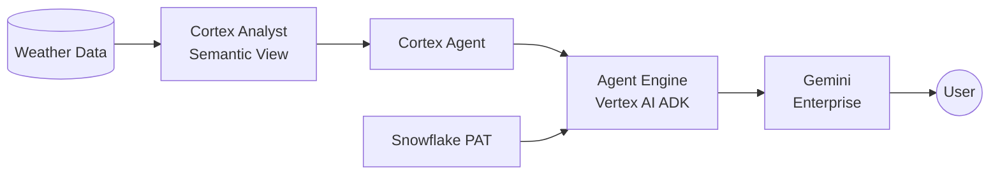

# Gemini Enterprise → Snowflake Cortex Agent (via REST API)

Contact: ali.khosro@snowflake.com
Status: **POC Complete — Working** (March 2026)

## What This Project Does

Lets **Gemini Enterprise (GE)** users ask natural-language questions about data in Snowflake and get answers — without leaving GE, without knowing SQL, and without managing infrastructure.

Example: User asks *"What was the hottest day in 2021?"* in GE → gets *"June 29, 2021, 87.9°F"* back from Snowflake data.

## Architecture



A **Vertex AI Agent Engine** agent (built with Google ADK Python SDK) has a single tool — `ask_snowflake` — that POSTs to the Snowflake **Cortex Agent `:run` REST API** using a PAT. GE routes user questions to the Agent Engine, which calls the Cortex Agent, and returns the answer.

## Why This Architecture (and Not Something Else)

We evaluated four approaches. Only one works today:

| Approach | Result | Why |
|----------|--------|-----|
| **MCP** | Failed | Snowflake MCP uses JSON-RPC/HTTPS; GE expects Streamable HTTP — incompatible protocols |
| **GE Custom Actions (OpenAPI)** | Failed | Deprecated March 2026. GE Admin Console no longer supports arbitrary REST endpoints |
| **GE Agent Authorization (OAuth)** | Failed | GE omits `response_type=code` in OAuth redirect — confirmed GE-side bug. Snowflake OAuth works independently (see `oauth-test.md`) |
| **ADK Agent on Agent Engine** | **Works** | Native GE integration, single Python deploy script, PAT auth, ~1 day effort |

Full analysis with comparison matrix: `feasibility-study.md`
Product team report on issues found: `integration-report.md`

## Key Discoveries

1. **GE Custom Actions are gone** — replaced by pre-built data connectors (BigQuery, Drive, etc.) with no generic REST option
2. **GE OAuth is buggy** — the authorize redirect is missing `response_type=code` (required by OAuth 2.0 / RFC 6749). We proved this independently (`oauth-test.md`)
3. **Agent Engine egress IPs are not standard GCP IPs** — they come from `136.124.x.x`, not the usual `34.x/35.x` ranges. You must discover the IP from error logs and add it to Snowflake's network policy
4. **PAT baked into pickle works** — the `SNOWFLAKE_PAT` env var is captured by `cloudpickle` at deploy time and available inside the Agent Engine container
5. **Two LLM hops add latency** — gemini-2.5-flash (Agent Engine orchestration) + Cortex Agent's internal LLM = ~20s per query
6. **`staging_bucket` must be passed to both** `aiplatform.init()` and `vertexai.init()` or deployment fails silently

## Document Hierarchy

```
requirements.md          ← Product vision, user story, functional/non-functional requirements
    ↓ drives
plan.md                  ← Step-by-step execution plan (0a-0d + steps 1-4, all Done)
    ↓ directs
quickstart.md            ← Full self-contained end-to-end guide (all code inline)
    ↓ condensed into
demo.md                  ← Minimal guide for demoing to customers
                           (uses deploy_agent.py, verify_agent.py)
```

Supporting documents:

| File | Purpose |
|------|---------|
| `feasibility-study.md` | All 4 approaches evaluated with comparison matrix and verdicts |
| `integration-report.md` | Formal report for GCP/Snowflake product teams on issues found |
| `oauth-test.md` | Standalone OAuth test proving the GE `response_type` bug |
| `skill.md` | CoCo skill reference (copy of `.snowflake/cortex/skills/ge-cortex-agent-integration/SKILL.md`) |

## Code Files

| File | What It Does |
|------|-------------|
| `deploy_agent.py` | Deploys the ADK agent to Vertex AI Agent Engine with `ask_snowflake` tool |
| `verify_agent.py` | Lists deployed agents (most recent first) and verifies end-to-end |

## Files to Delete (superseded)

| File | Reason |
|------|--------|
| `test_agent.py` | Content inline in `quickstart.md` |
| `test_agent.sh` | Content inline in `quickstart.md` |
| `test_oauth.py` | Content referenced from `oauth-test.md` |
| `list_agents.py` | Merged into `verify_agent.py` |
| `cortex-agent-openapi.yaml` | Created for deprecated GE Custom Actions path |
| `entraid-addon.md` | Out of scope for this project |

## Environment

| Variable | Value | Description |
|----------|-------|-------------|
| SNOWFLAKE_ACCOUNT | qn43380 | Snowflake account identifier |
| SNOWFLAKE_REGION | us-central1.gcp | Account region |
| SNOWFLAKE_ACCOUNT_URL | https://qn43380.us-central1.gcp.snowflakecomputing.com | Full account URL |
| GCP_PROJECT | snowflake-corp-pse-poc | GCP project ID |
| CORTEX_AGENT_NAME | NY_WEATHER_AGENT | Existing Cortex Agent in `poc.ai` |
| SEMANTIC_VIEW | WEATHER_MAN | Semantic view used by the agent (queries `POC.WEATHER.NY_DAILY`) |
| USER_ROLE | POC | Snowflake role for access |
| REASONING_ENGINE_ID | 4700720621753991168 | Deployed Agent Engine resource |

## Production Gaps (Out of Scope for POC)

- **PAT rotation** — PAT is baked into the pickle; rotation requires redeployment. Use GCP Secret Manager for production.
- **Agent Engine IP changes** — egress IPs are undocumented and may change. Monitor logs.
- **Latency** — ~20s due to two LLM hops. No easy fix without removing one hop.
- **Network policy automation** — account-level policy is recreated every 12 hours by security team automation, wiping attached network rules.
