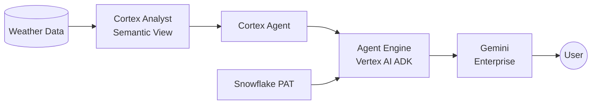

# Gemini Enterprise → Snowflake Cortex Agent (via REST API)

Contact: ali.khosro@snowflake.com
Status: **POC Complete — Working** (March 2026)

## What This Project Does

Lets **Gemini Enterprise (GE)** users ask natural-language questions about data in Snowflake and get answers — without leaving GE, without knowing SQL, and without managing infrastructure.

Example: User asks *"What was the hottest day in 2021?"* in GE → gets *"June 29, 2021, 87.9°F"* back from Snowflake data.

## Architecture



A **Vertex AI Agent Engine** agent (built with Google ADK Python SDK) has a single tool — `ask_snowflake` — that POSTs to the Snowflake **Cortex Agent `:run` REST API** using a PAT. GE routes user questions to the Agent Engine, which calls the Cortex Agent, and returns the answer.

## Document Hierarchy

```
requirements.md          ← Product vision, user story, functional/non-functional requirements
    ↓ drives
plan.md                  ← Step-by-step execution plan (0a-0d + steps 1-4, all Done)
    ↓ directs
quickstart.md            ← Full self-contained end-to-end guide (all code inline)
    ↓ condensed into
demo.md                  ← Minimal guide for demoing to customers
                           (uses deploy_agent.py, verify_agent.py)
```

Supporting documents:

| File | Purpose |
|------|---------|
| `feasibility-study.md` | Approaches evaluated with comparison matrix |
| `integration-report.md` | Formal report for GCP/Snowflake product teams |
| `skill.md` | CoCo skill reference (copy of `.snowflake/cortex/skills/ge-cortex-agent-integration/SKILL.md`) |

## Code Files

| File | What It Does |
|------|-------------|
| `deploy_agent.py` | Deploys the ADK agent to Vertex AI Agent Engine with `ask_snowflake` tool |
| `verify_agent.py` | Lists deployed agents (most recent first) and verifies end-to-end |


## Environment

| Variable | Value | Description |
|----------|-------|-------------|
| SNOWFLAKE_ACCOUNT | qn43380 | Snowflake account identifier |
| SNOWFLAKE_REGION | us-central1.gcp | Account region |
| SNOWFLAKE_ACCOUNT_URL | https://qn43380.us-central1.gcp.snowflakecomputing.com | Full account URL |
| GCP_PROJECT | snowflake-corp-pse-poc | GCP project ID |
| CORTEX_AGENT_NAME | NY_WEATHER_AGENT | Existing Cortex Agent in `poc.ai` |
| SEMANTIC_VIEW | WEATHER_MAN | Semantic view used by the agent (queries `POC.WEATHER.NY_DAILY`) |
| USER_ROLE | POC | Snowflake role for access |
| REASONING_ENGINE_ID | 8224884087194648576 | Deployed Agent Engine resource |

## Production Considerations

- **PAT management** — For production, store PAT in GCP Secret Manager with automated rotation.
- **Network policy** — Ensure Agent Engine IPs are whitelisted in your Snowflake network policy.
