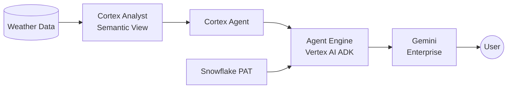

# Gemini Enterprise + Snowflake Cortex Agent Integration

## What Works (March 2026)

The only working path to connect Gemini Enterprise to a Snowflake Cortex Agent:

```
User (GE) → Agent Engine (Vertex AI, ADK) → Cortex Agent :run REST API (PAT auth) → Snowflake Data
```

## What Does NOT Work

| Approach | Why |
|----------|-----|
| **GE Custom Actions (OpenAPI)** | Deprecated March 2026. GE Admin Console redirects to data connectors that don't support arbitrary REST. |
| **GE Agent Authorization (OAuth)** | GE omits `response_type=code` in OAuth authorize redirect. Snowflake rejects it. Confirmed bug — Snowflake OAuth works independently. |
| **MCP** | Snowflake MCP uses JSON-RPC/HTTPS; GE expects Streamable HTTP. Incompatible protocols. |

## Architecture



## Step-by-Step Summary

### 0. Snowflake Prerequisites
- Get weather data from Marketplace (Weather Source LLC - Frostbyte)
- Create filtered table: `POC.WEATHER.NY_DAILY`
- Create semantic view: Snowsight → AI & ML → Cortex Analyst → `POC.AI.WEATHER_MAN`
- Create Cortex Agent: Snowsight → AI & ML → Cortex Agents → `NY_WEATHER_AGENT`
- Create PAT: Snowsight → Profile → Programmatic Access Tokens (Role: `POC`)

### 1. Deploy Agent Engine (Python ADK)
- `gcloud auth application-default login`
- Enable `aiplatform.googleapis.com` in GCP project
- Create GCS staging bucket
- `export SNOWFLAKE_PAT="<pat>" && python deploy_agent.py`
- PAT captured from env var at deploy time (baked into pickle)
- `staging_bucket` must go in both `aiplatform.init()` and `vertexai.init()`

### 2. Verify + Network Policy
- `python verify_agent.py` — lists agents, tests most recent
- Agent Engine egress IPs are NOT in standard GCP ranges (136.124.x.x)
- If blocked: extract IP from error, add network rule + attach to policy

### 3. Register in GE
- GE Admin Console → Agents → Agent Engine (Vertex AI)
- Paste Reasoning Engine resource path
- **Skip Agent Authorization** (OAuth not needed — PAT is baked in)
- Add user permissions

### 4. Ask a Question
- Open Gemini Enterprise, ask "What was the hottest day in 2021?"
- Expected: June 29, 2021, 87.9°F

## Key Gotchas

| Issue | Solution |
|-------|----------|
| `staging_bucket` error | Pass to BOTH `aiplatform.init()` and `vertexai.init()` |
| Model 404 | Enable `aiplatform.googleapis.com` API; use `gemini-2.5-flash` |
| Old pickle after code change | Each `agent_engines.create()` makes a new engine — use latest resource ID |
| IP blocked by network policy | Check error logs for IP; add via network rule |
| GE shows "thinking" then nothing | Check Agent Engine logs: `gcloud logging read 'resource.type="aiplatform.googleapis.com/ReasoningEngine" AND severity>=ERROR'` |
| GE OAuth `response_type` error | Known GE bug — skip Agent Authorization, use PAT baked into agent |
| `400 missing execution environment` | Set user default warehouse or add `execution_environment` to agent spec |

## Testing the Deployed Agent (without GE)

```python
import vertexai
from vertexai import agent_engines

vertexai.init(project='snowflake-corp-pse-poc', location='us-central1')
engines = sorted(agent_engines.list(), key=lambda e: e.create_time, reverse=True)
agent = engines[0]

session = agent.create_session(user_id='test-user')
response = agent.stream_query(
    user_id='test-user',
    session_id=session['id'],
    message='What was the hottest day in 2021?',
)
for event in response:
    print(event)
```

## Reference Project

Full implementation: `GCP/projects/gemini-enterprise-calls-cortex/via-REST/`

| File | Purpose |
|------|---------|
| `demo.md` | Minimal guide for customer demos |
| `quickstart.md` | Full self-contained end-to-end guide |
| `deploy_agent.py` | ADK agent deployment script |
| `verify_agent.py` | Lists agents and verifies end-to-end |
| `integration-report.md` | Report for GCP/Snowflake product teams |
| `oauth-test.md` | Standalone OAuth test proving GE bug |
| `feasibility-study.md` | All approaches evaluated |
