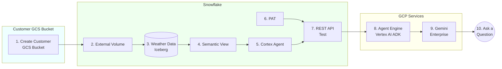

# Demo: Gemini Enterprise calls Snowflake Cortex Agent

> For the full guide with troubleshooting, inline code, and cleanup: [quickstart.md](./quickstart.md)



## Prerequisites

- GCP project: `snowflake-corp-pse-poc`
- GCP auth: run in terminal: `gcloud auth application-default login --project=snowflake-corp-pse-poc`

## Files

| File | What |
|------|------|
| `deploy_agent.py` | Deploys the agent to Vertex AI Agent Engine |
| `verify_agent.py` | Lists agents and verifies the most recent one end-to-end |

---

# Part 1: GCS Infrastructure

## Step 1. Create Customer GCS Bucket

```bash
gsutil mb -l us-central1 -p snowflake-corp-pse-poc gs://snowflake-corp-pse-poc-iceberg
```

## Step 2. Create External Volume

```sql
USE ROLE ACCOUNTADMIN;

CREATE OR REPLACE EXTERNAL VOLUME my_gcs_iceberg_vol
  STORAGE_LOCATIONS = (
    (
      NAME = 'gcs-iceberg'
      STORAGE_BASE_URL = 'gcs://snowflake-corp-pse-poc-iceberg/'
      STORAGE_PROVIDER = 'GCS'
    )
  )
  ALLOW_WRITES = TRUE;

DESCRIBE EXTERNAL VOLUME my_gcs_iceberg_vol;
```

Copy the `STORAGE_GCP_SERVICE_ACCOUNT` from the output and grant it **Storage Object Admin** on the bucket:

```bash
gsutil iam ch serviceAccount:<SERVICE_ACCOUNT>:roles/storage.objectAdmin gs://snowflake-corp-pse-poc-iceberg
```

---

# Part 2: Snowflake Prerequisites

## Step 3. Get Weather Data (Iceberg)

1. Snowflake Marketplace → search **"Weather Source LLC - Frostbyte"** → get the listing
2. It creates database `WEATHER_SOURCE_LLC_FROSTBYTE` with view `ONPOINT_ID.HISTORY_DAY`
3. Create a filtered Iceberg table for NY daily weather:

```sql
USE ROLE POC;

CREATE DATABASE IF NOT EXISTS poc;
CREATE SCHEMA IF NOT EXISTS poc.weather;

CREATE OR REPLACE ICEBERG TABLE poc.weather.ny_daily (
    postal_code                    VARCHAR,
    country                        VARCHAR,
    date_valid_std                 DATE,
    avg_temperature_air_2m_f       FLOAT,
    avg_humidity_relative_2m_pct   FLOAT,
    avg_wind_speed_10m_mph         FLOAT,
    tot_precipitation_in           FLOAT,
    tot_snowfall_in                FLOAT,
    avg_cloud_cover_tot_pct        FLOAT
)
    EXTERNAL_VOLUME = 'my_gcs_iceberg_vol'
    CATALOG = 'SNOWFLAKE'
    BASE_LOCATION = 'poc/weather/ny_daily/';

INSERT INTO poc.weather.ny_daily
SELECT postal_code, country, date_valid_std,
       avg_temperature_air_2m_f, avg_humidity_relative_2m_pct,
       avg_wind_speed_10m_mph, tot_precipitation_in,
       tot_snowfall_in, avg_cloud_cover_tot_pct
FROM WEATHER_SOURCE_LLC_FROSTBYTE.ONPOINT_ID.HISTORY_DAY
WHERE country = 'US' AND postal_code LIKE '1%';
```

## Step 4. Create Cortex Analyst Semantic View

1. Snowsight → **AI & ML** → **Cortex Analyst** → **Create Semantic View**
2. Select table `POC.WEATHER.NY_DAILY`, name it `POC.AI.WEATHER_MAN`
3. Review generated column descriptions and save

## Step 5. Create Cortex Agent

1. Snowsight → **AI & ML** → **Cortex Agents** → **Create Agent**
2. Name: `NY_WEATHER_AGENT`, Database: `POC`, Schema: `AI`
3. Add tool: **Cortex Analyst** → select `WEATHER_MAN` semantic view
4. Add sample questions: "What was the hottest day in 2021?", "What was the average temperature in January 2020?"
5. Save

## Step 6. Create PAT

1. Snowsight → **user avatar** → **Profile** → **Programmatic Access Tokens**
2. **+ Generate New Token** → Role: `POC`, Expiration: 30 days
3. Copy and save the token immediately

---

# Part 3: Test Cortex Agent REST API

## Step 7. Test REST API

Before deploying to Agent Engine, verify the REST API works directly:

```bash
SNOWFLAKE_ACCOUNT_URL="https://qn43380.us-central1.gcp.snowflakecomputing.com"
AGENT_RUN_ENDPOINT="/api/v2/databases/poc/schemas/ai/agents/NY_WEATHER_AGENT:run"
PAT_TOKEN="<YOUR_PAT_TOKEN>"

curl -X POST "${SNOWFLAKE_ACCOUNT_URL}${AGENT_RUN_ENDPOINT}" \
  -H "Content-Type: application/json" \
  -H "Authorization: Bearer ${PAT_TOKEN}" \
  -H "Accept: application/json" \
  -d '{
    "messages": [
      {
        "role": "user",
        "content": [
          {
            "type": "text",
            "text": "What was the hottest day in 2021?"
          }
        ]
      }
    ],
    "stream": false
  }'
```

**Expected:** HTTP 200 with JSON containing "June 29, 2021" and "87.9°F".

---

# Part 4: Deploy Agent to Vertex AI

## Step 8. Deploy Agent to Vertex AI

```bash
pip install google-adk google-cloud-aiplatform requests
gcloud services enable aiplatform.googleapis.com --project=snowflake-corp-pse-poc
gsutil mb -l us-central1 -p snowflake-corp-pse-poc gs://snowflake-corp-pse-poc-agent-staging

export SNOWFLAKE_PAT="<your PAT from step 6>"
python deploy_agent.py
```

Note the `Resource: projects/.../reasoningEngines/<ID>` output.

### Verify Deployed Agent

```bash
python verify_agent.py             # lists agents, verifies most recent
python verify_agent.py --list-only  # just list agents
```

If it fails with an IP error, whitelist the IP in Snowflake:

```sql
USE ROLE ACCOUNTADMIN;
CREATE OR REPLACE NETWORK RULE admin_db.network.agent_engine_rule
  MODE = INGRESS TYPE = IPV4 VALUE_LIST = ('<IP>/16');
ALTER NETWORK POLICY <YOUR_POLICY>
  ADD ALLOWED_NETWORK_RULE_LIST = ('ADMIN_DB.NETWORK.AGENT_ENGINE_RULE');
```

Then re-run `python verify_agent.py`.

---

# Part 5: Register in Gemini Enterprise

## Step 9. Register in Gemini Enterprise

1. GE Admin Console → Agents → Create → **Agent Engine (Vertex AI)**
2. Paste the resource path from step 8
3. **Skip** Agent Authorization (PAT is baked into the agent)
4. Add yourself to User Permissions

---

# Part 6: Ask a Question

## Step 10. Ask a Question

Open Gemini Enterprise: **"What was the hottest day in 2021?"**

→ **June 29, 2021, 87.9°F**
