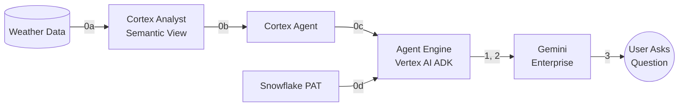

# Demo: Gemini Enterprise calls Snowflake Cortex Agent

> For the full guide with troubleshooting, inline code, and cleanup: [quickstart.md](./quickstart.md)



## Prerequisites

- GCP project: `snowflake-corp-pse-poc`
- GCP auth: run in terminal: `gcloud auth application-default login --project=snowflake-corp-pse-poc`

## Files

| File | What |
|------|------|
| `deploy_agent.py` | Deploys the agent to Vertex AI Agent Engine |
| `verify_agent.py` | Lists agents and verifies the most recent one end-to-end |

---

## 0a. Get Weather Data

1. Snowflake Marketplace → search **"Weather Source LLC - Frostbyte"** → get the listing
2. It creates database `WEATHER_SOURCE_LLC_FROSTBYTE` with view `ONPOINT_ID.HISTORY_DAY`
3. Create a filtered table for NY daily weather:

```sql
CREATE DATABASE IF NOT EXISTS poc;
CREATE SCHEMA IF NOT EXISTS poc.weather;

CREATE OR REPLACE TABLE poc.weather.ny_daily AS
SELECT postal_code, country, date_valid_std,
       avg_temperature_air_2m_f, avg_humidity_relative_2m_pct,
       avg_wind_speed_10m_mph, tot_precipitation_in,
       tot_snowfall_in, avg_cloud_cover_tot_pct
FROM WEATHER_SOURCE_LLC_FROSTBYTE.ONPOINT_ID.HISTORY_DAY
WHERE country = 'US' AND postal_code LIKE '1%';
```

## 0b. Create Cortex Analyst Semantic View

1. Snowsight → **AI & ML** → **Cortex Analyst** → **Create Semantic View**
2. Select table `POC.WEATHER.NY_DAILY`, name it `POC.AI.WEATHER_MAN`
3. Review generated column descriptions and save

## 0c. Create Cortex Agent

1. Snowsight → **AI & ML** → **Cortex Agents** → **Create Agent**
2. Name: `NY_WEATHER_AGENT`, Database: `POC`, Schema: `AI`
3. Add tool: **Cortex Analyst** → select `WEATHER_MAN` semantic view
4. Set instructions/sample questions as needed, save

## 0d. Create PAT

1. Snowsight → **user avatar** → **Profile** → **Programmatic Access Tokens**
2. **+ Generate New Token** → Role: `POC`, Expiration: 30 days
3. Copy and save the token immediately

---

## 1. Deploy Agent to Vertex AI

```bash
pip install google-adk google-cloud-aiplatform requests
gcloud services enable aiplatform.googleapis.com --project=snowflake-corp-pse-poc
gsutil mb -l us-central1 -p snowflake-corp-pse-poc gs://snowflake-corp-pse-poc-agent-staging

export SNOWFLAKE_PAT="<your PAT>"
python deploy_agent.py
```

Note the `Resource: projects/.../reasoningEngines/<ID>` output.

## 2. Verify Deployed Agent

```bash
python verify_agent.py             # lists agents, verifies most recent
python verify_agent.py --list-only  # just list agents
```

If it fails with an IP error, whitelist the IP in Snowflake:

```sql
USE ROLE ACCOUNTADMIN;
CREATE OR REPLACE NETWORK RULE admin_db.network.agent_engine_rule
  MODE = INGRESS TYPE = IPV4 VALUE_LIST = ('<IP>/16');
ALTER NETWORK POLICY <YOUR_POLICY>
  ADD ALLOWED_NETWORK_RULE_LIST = ('ADMIN_DB.NETWORK.AGENT_ENGINE_RULE');
```

Then re-run `python verify_agent.py`.

## 3. Register in Gemini Enterprise

1. GE Admin Console → Agents → Create → **Agent Engine (Vertex AI)**
2. Paste the resource path from step 1 or 2
3. **Skip** Agent Authorization
4. Add yourself to User Permissions

## 4. Ask a Question

Open Gemini Enterprise: **"What was the hottest day in 2021?"**

→ **June 29, 2021, 87.9°F**
