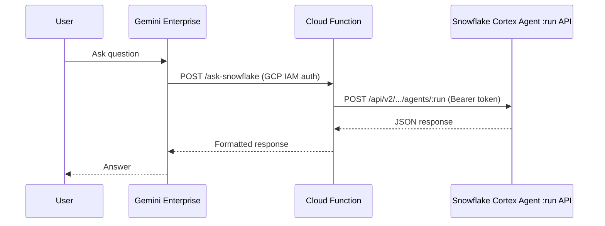
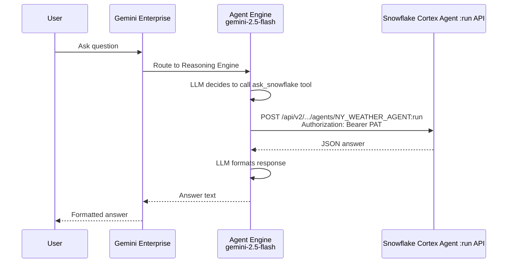

# Feasibility Study: Gemini Enterprise Calls Snowflake Cortex Agent

## Variables

| Variable | Value | Description |
|----------|-------|-------------|
| SNOWFLAKE_ACCOUNT | qn43380 | Snowflake account identifier |
| SNOWFLAKE_REGION | us-central1.gcp | Account region |
| SNOWFLAKE_ACCOUNT_URL | https://qn43380.us-central1.gcp.snowflakecomputing.com | Full account URL |
| GCP_PROJECT | snowflake-corp-pse-poc | GCP project ID |
| CORTEX_AGENT_NAME | NY_WEATHER_AGENT | Existing Cortex Agent |
| AGENT_DATABASE | poc | Agent database |
| AGENT_SCHEMA | ai | Agent schema |
| SEMANTIC_VIEW | WEATHER_MAN | Semantic view used by agent |

## Objective

Evaluate how Gemini Enterprise (GE) can call a Snowflake Cortex Agent to query enterprise data.

> **Note:** EntraID integration is out of scope for this POC. This study focuses on the core integration pattern and uses PAT for authentication.

---

## Why REST Architecture (and Not Something Else)

We evaluated four approaches. Only one works today:

| Approach | Result | Why |
|----------|--------|-----|
| **MCP** | Failed | Snowflake MCP uses JSON-RPC/HTTPS; GE expects Streamable HTTP — incompatible protocols |
| **GE Custom Actions (OpenAPI)** | Failed | Deprecated March 2026. GE Admin Console no longer supports arbitrary REST endpoints |
| **GE Agent Authorization (OAuth)** | Failed | GE omits `response_type=code` in OAuth redirect — confirmed GE-side bug. Snowflake OAuth works independently (see `oauth-test.md`) |
| **ADK Agent on Agent Engine** | **Works** | Native GE integration, single Python deploy script, PAT auth, ~1 day effort |

Full analysis with comparison matrix: `feasibility-study.md`
Product team report on issues found: `integration-report.md`

## Key Discoveries

1. **GE Custom Actions are gone** — replaced by pre-built data connectors (BigQuery, Drive, etc.) with no generic REST option
2. **GE OAuth is buggy** — the authorize redirect is missing `response_type=code` (required by OAuth 2.0 / RFC 6749). We proved this independently (`oauth-test.md`)
3. **Agent Engine egress IPs are not standard GCP IPs** — they come from `136.124.x.x`, not the usual `34.x/35.x` ranges. You must discover the IP from error logs and add it to Snowflake's network policy
4. **PAT baked into pickle works** — the `SNOWFLAKE_PAT` env var is captured by `cloudpickle` at deploy time and available inside the Agent Engine container
5. **Two LLM hops add latency** — gemini-2.5-flash (Agent Engine orchestration) + Cortex Agent's internal LLM = ~20s per query
6. **`staging_bucket` must be passed to both** `aiplatform.init()` and `vertexai.init()` or deployment fails silently

## Failed Approaches (in order of attempt)

### 1. MCP — Protocol Incompatibility

We attempted to connect GE to Snowflake via the Snowflake-managed MCP Server.

**Why it failed:**
- Snowflake MCP Server uses **JSON-RPC over HTTPS** (non-streaming POST requests)
- Snowflake docs confirm: **"Only non-streaming responses are supported"**
- GE expects **Streamable HTTP** transport for MCP connections
- These are **incompatible protocols** — no configuration change can fix this

**Verdict: NOT FEASIBLE**

### 2. GE Custom Actions (OpenAPI Spec) — Deprecated

We created an OpenAPI spec to call the Cortex Agent `:run` REST API directly as a GE Action.

**Why it failed:**
- The **Actions** menu in GE Admin Console (March 2026) states: *"Actions can now be configured directly on a data connector."*
- Available data connectors are pre-built (BigQuery, Drive, etc.) — **none support arbitrary REST endpoints**
- Custom Actions via OpenAPI upload no longer exists in the GE UI

**Verdict: DEPRECATED — no longer available**

### 3. GE Agent Authorization (OAuth) — Incompatible

When creating an Agent Engine agent in GE, we configured "Agent Authorization" with Snowflake OAuth credentials (client_id, client_secret, token_uri, auth_uri).

**Why it failed:**
- GE sends OAuth authorize request to Snowflake **without `response_type=code`** parameter
- Snowflake's `/oauth/authorize` endpoint **requires** `response_type=code` (OAuth 2.0 spec)
- Error: *"Invalid value for the response_type query parameter"*
- Also had redirect URI mismatch (GE uses `https://vertexaisearch.cloud.google.com/oauth-redirect`)

**Verdict: INCOMPATIBLE — GE's OAuth flow doesn't meet Snowflake's requirements**

> **Note:** This is a product-level incompatibility reported in [integration-report.md](integration-report.md).

### 4. `gemini-2.0-flash` Model — Not Available

Initial deployments used `gemini-2.0-flash` as the ADK agent model.

**Why it failed:**
- 404: *"Publisher Model `projects/.../publishers/google/models/gemini-2.0-flash` was not found"*
- The `aiplatform.googleapis.com` API was not enabled in the project
- Even after enabling, the model name format needed to be versioned

**Fix:** Enabled API + switched to `gemini-2.5-flash`

### 5. Network Policy Blocking Agent Engine IP

After fixing the model, the `ask_snowflake` tool call failed with 401.

**Why it failed:**
- Snowflake account has `ACCOUNT_VPN_POLICY_SE` network policy (99 allowed IPs)
- Agent Engine container's egress IP (`136.124.32.52`) was not in the allowlist
- This IP is NOT in standard GCP ranges (34.x/35.x) — it's a Google internal range

**Fix:** Added network rule for `136.124.32.0/24`

---

## Approaches Evaluated

### ~~Approach A: Direct REST API via GE Actions~~ — DEPRECATED

GE Custom Actions no longer exist. Cannot call arbitrary REST endpoints directly from GE.

### Approach B: Cloud Run / Cloud Function Proxy — FALLBACK

| Criterion | Score | Notes |
|-----------|-------|-------|
| Simplicity | ★★★☆☆ | Extra layer, but thin |
| Enterprise readiness | ★★★★★ | Full control over auth, logging, rate limiting |
| Effort | ★★★★☆ | 3-5 days |
| Cost | ★★★★☆ | Negligible for POC |

**Status:** Not attempted — Agent Engine worked.

### Approach C: ADK Agent on Agent Engine — **SELECTED & WORKING**

**How it works:**
1. Deploy a Google ADK agent to Vertex AI Agent Engine using `agent_engines.create()`
2. Agent uses `gemini-2.5-flash` as its LLM
3. Agent has one tool: `ask_snowflake` — a Python function that calls the Cortex Agent REST API with a PAT
4. PAT is baked into the deployed pickle via `cloudpickle` (set as env var at deploy time)
5. Register the Reasoning Engine resource path in GE Admin Console (no OAuth needed)
6. GE routes user questions to the agent

| Criterion | Score | Notes |
|-----------|-------|-------|
| Simplicity | ★★★★☆ | One agent layer with one tool; deploy via Python script |
| Enterprise readiness | ★★★★☆ | Native GE integration; Vertex AI enterprise features |
| Auth | ★★★★☆ | PAT for POC; OAuth upgrade path exists |
| Effort | ★★★★☆ | ~1 day including troubleshooting |
| Cost | ★★★★☆ | Agent Engine invocation costs (minimal) |
| Streaming | ★★★★☆ | ADK supports streaming |

**Result: WORKING — end-to-end flow confirmed**

### ~~Approach D: MCP Bridge~~ — REJECTED

Building an SSE-to-HTTP bridge is fragile and unnecessary.

---

## Comparison Matrix (Final)

| | ~~A: Direct REST~~ | B: Cloud Function | **C: ADK Agent Engine** | D: MCP Bridge |
|---|---|---|---|---|
| **Status** | Deprecated | Fallback | **WORKING** | Rejected |
| **Simplicity** | N/A | ★★★☆☆ | **★★★★☆** | ★☆☆☆☆ |
| **Enterprise Ready** | N/A | ★★★★★ | **★★★★☆** | ★☆☆☆☆ |
| **Auth Flexibility** | N/A | ★★★★☆ | **★★★★☆** | ★★☆☆☆ |
| **Effort** | N/A | 3-5 days | **~1 day** | 7+ days |
| **Infra Cost** | N/A | Minimal | **Minimal** | Medium |

## Recommendation

**Approach C (ADK Agent on Agent Engine)** is the only approach that works today and is recommended for production.

Key advantages:
- Native GE integration — no middleware, no custom infrastructure
- Cortex Agent REST API is stable and production-ready
- PAT auth is simple for POC; upgradeable to OAuth without architecture changes
- Agent Engine handles scaling, availability, and session management
- Deploy/update is a single Python script

**For production considerations:**
- Replace baked-in PAT with GCP Secret Manager or OAuth token rotation
- Monitor Agent Engine egress IPs for network policy changes
- Consider Approach B (Cloud Function) if stricter auth control is needed

## Authentication Note

This POC uses a **Snowflake PAT** baked into the deployed agent. The architecture is auth-method agnostic — the `ask_snowflake` function only needs a Bearer token, regardless of how it's obtained.

See [entraid-addon.md](entraid-addon.md) for the customer-facing EntraID integration guide.
