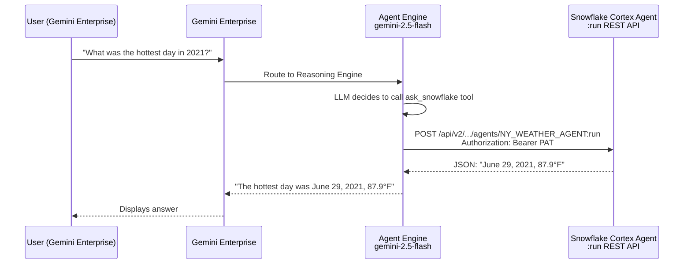

# Integration Report: Gemini Enterprise + Snowflake Cortex Agent

**Date:** March 31, 2026
**Author:** PSE Team (Snowflake)
**Audience:** GCP Product Integration Team, Snowflake Product Integration Team
**Status:** POC Complete — Working with Workaround

---

## Executive Summary

We successfully connected **Gemini Enterprise (GE)** to a **Snowflake Cortex Agent** so that enterprise users can ask natural-language questions in GE and receive answers from Snowflake data. However, the integration required a **workaround** — the two "ideal" integration paths (GE Custom Actions and GE Agent Authorization via OAuth) are both broken or deprecated. The working path uses **Vertex AI Agent Engine** with a PAT baked into the deployed agent.

This report documents:
1. What the ideal integration should look like
2. What product-level issues prevent it
3. What workaround we used
4. Recommendations for both product teams

---

## 1. The Ideal Integration (What Should Work)

### Option A: GE Custom Actions with OpenAPI Spec

The simplest, most direct path:

```
User → GE → HTTP POST (via OpenAPI Action) → Snowflake Cortex Agent :run API → Answer
```

- GE admin uploads an OpenAPI spec defining the Cortex Agent `:run` endpoint
- GE sends the request directly with a Bearer token
- Zero middleware, zero extra infrastructure

**Status: NOT POSSIBLE — GE Custom Actions are deprecated (March 2026)**

The GE Admin Console now states: *"Actions can now be configured directly on a data connector."* The available data connectors are pre-built (BigQuery, Drive, etc.) and do not support arbitrary REST endpoints.

### Option B: GE Agent Engine with OAuth to Snowflake

The next best path:

```
User → GE → Agent Engine (with OAuth to Snowflake) → Cortex Agent :run API → Answer
```

- Deploy an ADK agent to Agent Engine
- Configure GE Agent Authorization with Snowflake OAuth credentials
- GE handles OAuth token lifecycle, agent handles the REST call

**Status: NOT POSSIBLE — OAuth flow incompatibility**

---

## 2. Product-Level Issues

### Issue 1: GE Custom Actions Deprecated Without REST Replacement

**Affected product:** Gemini Enterprise (GCP)
**Severity:** High

GE Custom Actions (OpenAPI spec upload) have been replaced by data connectors. However, the data connectors only support pre-built integrations (BigQuery, Google Drive, etc.). There is **no way to call an arbitrary REST API** from GE without deploying middleware.

**Impact:** Any integration with a non-Google REST API (Snowflake, Salesforce, etc.) now requires deploying an Agent Engine agent or Cloud Function as middleware — significantly increasing complexity.

**Recommendation:** Restore the ability to create custom HTTP actions from OpenAPI specs, or add a "Generic REST API" data connector.

### Issue 2: GE Agent Authorization OAuth Missing `response_type` Parameter

**Affected products:** Gemini Enterprise (GCP)
**Severity:** High
**Status:** Root cause confirmed — see [oauth-test.md](oauth-test.md)

When GE Agent Authorization is configured with OAuth credentials (client_id, client_secret, token_uri, auth_uri), GE redirects to the authorization endpoint **without the `response_type=code` query parameter**.

**Observed URL from GE:**
```
https://qn43380.us-central1.gcp.snowflakecomputing.com/oauth/authorize
  ?client_id=wCA1PKeE2v0/cvwljkcpUrI%2BuHk%3D
  &state=eyJ...
  &redirect_uri=https://vertexaisearch.cloud.google.com/oauth-redirect
```

**Missing:** `response_type=code` (required by OAuth 2.0 spec, RFC 6749 Section 4.1.1)

**Snowflake error:** *"Invalid value for the response_type query parameter"*

**Independent verification (March 31, 2026):** We ran the same OAuth flow manually with `response_type=code` included. All three steps passed:
- Authorization code: **issued successfully**
- Token exchange: **Bearer access token received** (expires_in: 599s)
- Cortex Agent call with OAuth token: **returned correct answer** (June 29, 2021, 87.9°F)

**GE re-test (March 31, 2026):** After fixing all other issues (model name, API enablement, network policy), we created a new GE agent with OAuth credentials. GE still redirects to Snowflake's `/oauth/authorize` **without `response_type=code`**. The error is identical. This rules out any confounding factors — the bug is exclusively in GE's OAuth implementation.

**Conclusion:** Snowflake OAuth is fully functional. The problem is **exclusively** that GE Agent Authorization does not send `response_type=code` in the authorize redirect. This is a GE-side bug.

**Additional issue:** GE uses `https://vertexaisearch.cloud.google.com/oauth-redirect` as the redirect URI, which must be configured in the Snowflake OAuth integration. This is not documented anywhere.

**Recommendation (GCP):** Fix the OAuth authorize request to include `response_type=code`. Document the redirect URI used by GE Agent Authorization.

**Recommendation (Snowflake):** Consider accepting requests without `response_type` and defaulting to `code` for backward compatibility.

---

## 3. What Worked: The Workaround

### Architecture



### How It Works

1. **ADK Agent** deployed to Vertex AI Agent Engine via Python SDK (`agent_engines.create()`)
2. Agent uses **gemini-2.5-flash** as its orchestration LLM
3. Agent has one tool: `ask_snowflake` — a Python function that calls the Cortex Agent REST API
4. **Snowflake PAT** is baked into the deployed agent pickle (captured from env var at deploy time)
5. Agent Engine resource registered in GE Admin Console (**without** Agent Authorization / OAuth)
6. Snowflake **network rule** added to allow Agent Engine egress IP (`136.124.32.0/24`)

### Why This Works

- The Cortex Agent `:run` REST API is stable, production-ready, and supports `stream: false` for synchronous JSON responses
- Agent Engine natively integrates with GE — no custom Actions needed
- PAT auth is simple and requires no OAuth flow
- The ADK agent acts as a thin translation layer (natural language → REST call → natural language)

### Limitations

- PAT is baked into the pickle — rotation requires redeployment
- Agent Engine egress IPs are undocumented and may change
- Two LLM hops (gemini-2.5-flash for orchestration + Cortex Agent's internal LLM) add latency (~20s per query)
- GE Agent Authorization (OAuth) doesn't work — auth is handled entirely within the agent

---

## 4. Recommendations

### For GCP Product Team

| # | Recommendation | Priority |
|---|---------------|----------|
| 1 | **Fix OAuth `response_type` in GE Agent Authorization** — the authorize request must include `response_type=code` | High |
| 2 | **Add Generic REST API connector** to replace deprecated Custom Actions | High |
| 3 | **Document the redirect URI** used by GE Agent Authorization (`vertexaisearch.cloud.google.com/oauth-redirect`) | Medium |

### For Snowflake Product Team

| # | Recommendation | Priority |
|---|---------------|----------|
| 1 | **Consider defaulting `response_type` to `code`** when not provided in OAuth authorize requests | Medium |

### For Joint Consideration

| # | Recommendation | Priority |
|---|---------------|----------|
| 1 | **First-party Snowflake connector in GE** — similar to BigQuery connector, but for Cortex Agents | High |
| 2 | **MCP protocol alignment** — Snowflake's MCP uses JSON-RPC/HTTPS; GE expects Streamable HTTP. Aligning on protocol would enable native MCP integration | Medium |

---

## 5. Environment Details

| Component | Value |
|-----------|-------|
| Snowflake Account | `qn43380` (us-central1.gcp) |
| GCP Project | `snowflake-corp-pse-poc` |
| Cortex Agent | `poc.ai.NY_WEATHER_AGENT` |
| Semantic View | `poc.ai.WEATHER_MAN` |
| Agent Engine Model | `gemini-2.5-flash` |
| Agent Engine Resource | `projects/138540327209/locations/us-central1/reasoningEngines/4700720621753991168` |
| Network Rule | `ADMIN_DB.NETWORK.AGENT_ENGINE_IP_RULE` (136.124.32.0/24) |
| Date Tested | March 31, 2026 |

---

## 6. Files in This Project

| File | Description |
|------|-------------|
| `README.md` | Project overview for LLM/developer onboarding |
| `requirements.md` | Product requirements and success criteria |
| `plan.md` | Step-by-step execution plan with results |
| `demo.md` | Minimal guide for customer demos |
| `quickstart.md` | Full self-contained end-to-end guide |
| `deploy_agent.py` | Python script to deploy the ADK agent to Agent Engine |
| `verify_agent.py` | Lists deployed agents and verifies end-to-end |
| `feasibility-study.md` | All approaches evaluated with comparison matrix |
| `integration-report.md` | This report |
| `oauth-test.md` | Standalone OAuth test proving GE bug |
| `skill.md` | CoCo skill reference |
