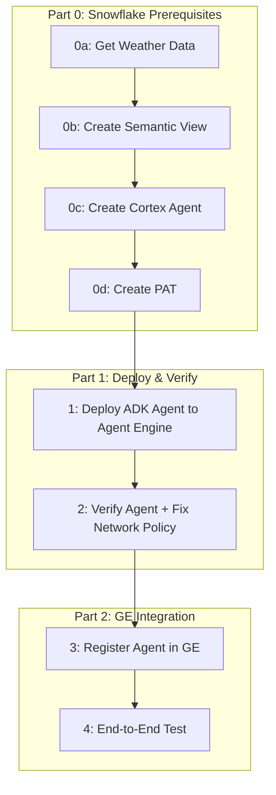

# Plan: Gemini Enterprise Calls Snowflake Cortex Agent via REST API

> This plan drives [quickstart.md](./quickstart.md) and [demo.md](./demo.md). Requirements are in [requirements.md](./requirements.md).

## Variables

| Variable | Value | Description |
|----------|-------|-------------|
| SNOWFLAKE_ACCOUNT | qn43380 | Snowflake account identifier |
| SNOWFLAKE_REGION | us-central1.gcp | Account region |
| SNOWFLAKE_ACCOUNT_URL | https://qn43380.us-central1.gcp.snowflakecomputing.com | Full account URL |
| GCP_PROJECT | snowflake-corp-pse-poc | GCP project ID |
| CORTEX_AGENT_NAME | NY_WEATHER_AGENT | Existing Cortex Agent |
| AGENT_DATABASE | poc | Agent database |
| AGENT_SCHEMA | ai | Agent schema |
| SEMANTIC_VIEW | WEATHER_MAN | Semantic view used by agent |
| USER_ROLE | POC | Snowflake role for access |
| AGENT_RUN_ENDPOINT | /api/v2/databases/poc/schemas/ai/agents/NY_WEATHER_AGENT:run | Agent :run API path |
| REASONING_ENGINE_ID | 4700720621753991168 | Deployed Agent Engine resource |

---

## Overview



### Execution Context

| Step | Who | Where | Status |
|------|-----|-------|--------|
| 0a | You or AI | Snowsight (Marketplace + SQL) | **Done** |
| 0b | You | Snowsight UI (Cortex Analyst) | **Done** |
| 0c | You | Snowsight UI (Cortex Agents) | **Done** |
| 0d | You (manual) | Snowsight Profile | **Done** |
| 1 | You | Cloud Shell / local terminal | **Done** |
| 2 | You + AI | Terminal + Snowsight SQL | **Done** |
| 3 | You (manual) | GE Admin Console | **Done** |
| 4 | You (manual) | Gemini Enterprise | **Done** |

---

## Part 0: Snowflake Prerequisites

### 0a: Get Weather Data ✅

**Goal:** Get Frostbyte weather data from Marketplace and create filtered NY table.

**Actions:**
- Marketplace → "Weather Source LLC - Frostbyte" → get listing
- Creates `WEATHER_SOURCE_LLC_FROSTBYTE` database
- `CREATE TABLE poc.weather.ny_daily AS SELECT ... FROM WEATHER_SOURCE_LLC_FROSTBYTE.ONPOINT_ID.HISTORY_DAY WHERE country = 'US' AND postal_code LIKE '1%'`

**Result:** `POC.WEATHER.NY_DAILY` table created with ~100K+ rows.

### 0b: Create Cortex Analyst Semantic View ✅

**Goal:** Create a semantic view over the weather table.

**Actions:**
- Snowsight → AI & ML → Cortex Analyst → Create Semantic View
- Table: `POC.WEATHER.NY_DAILY`, Name: `POC.AI.WEATHER_MAN`

**Result:** Semantic view `WEATHER_MAN` created.

### 0c: Create Cortex Agent ✅

**Goal:** Create a Cortex Agent using the semantic view.

**Actions:**
- Snowsight → AI & ML → Cortex Agents → Create Agent
- Name: `NY_WEATHER_AGENT`, Database: `POC`, Schema: `AI`
- Tool: Cortex Analyst → `WEATHER_MAN`

**Result:** Agent exists, responds correctly in Snowsight UI.

### 0d: Create PAT ✅

**Goal:** Create a Programmatic Access Token for REST API auth.

**Actions:**
- Snowsight → Profile → Programmatic Access Tokens → Generate New Token
- Role: `POC`, Expiration: 30 days

**Result:** PAT created and saved.

---

## Part 1: Deploy & Verify

### Step 1: Deploy ADK Agent to Vertex AI Agent Engine ✅

**Goal:** Create and deploy a Reasoning Engine with an `ask_snowflake` tool.

**Actions:**
1. `gcloud auth application-default login`
2. Enable `aiplatform.googleapis.com` in GCP project
3. Create GCS staging bucket (`gs://snowflake-corp-pse-poc-agent-staging`)
4. `export SNOWFLAKE_PAT="<pat>" && python deploy_agent.py`

**Key learnings:**
- Model must be a valid Vertex AI model (e.g., `gemini-2.5-flash`, not `gemini-2.0-flash`)
- `staging_bucket` must be passed to both `aiplatform.init()` and `vertexai.init()`
- `SNOWFLAKE_PAT` env var is captured at deploy time via cloudpickle
- Each `agent_engines.create()` creates a **new** Reasoning Engine with a new ID

**Result:** Reasoning Engine deployed at `projects/138540327209/locations/us-central1/reasoningEngines/4700720621753991168`

### Step 2: Verify Agent + Fix Network Policy ✅

**Goal:** Confirm deployed agent can reach Snowflake, whitelist IP if blocked.

**Actions:**
- `python verify_agent.py` — lists agents, tests most recent
- If IP blocked: extract IP from error, add network rule

```sql
USE ROLE ACCOUNTADMIN;
CREATE OR REPLACE NETWORK RULE admin_db.network.agent_engine_rule
  MODE = INGRESS TYPE = IPV4 VALUE_LIST = ('<IP>/16');
ALTER NETWORK POLICY ACCOUNT_VPN_POLICY_SE
  ADD ALLOWED_NETWORK_RULE_LIST = ('ADMIN_DB.NETWORK.AGENT_ENGINE_RULE');
```

**Key learning:** Agent Engine containers use Google Cloud egress IPs that are NOT in standard GCP IP ranges (34.x/35.x). The actual IP was discovered from error logs (`136.124.32.52`).

**Result:** Network rule added, REST API calls from Agent Engine succeed.

---

## Part 2: GE Integration

### Step 3: Register Agent in GE Admin Console ✅

**Goal:** Make the Agent Engine agent available in Gemini Enterprise.

**Actions:**
1. GE Admin Console → Agents → Create Agent → **Agent Engine (Vertex AI)**
2. Reasoning Engine source: `projects/138540327209/locations/us-central1/reasoningEngines/4700720621753991168`
3. **Skip** Agent Authorization (OAuth not needed — PAT is baked in)
4. Add user permissions

**Key learning:** GE Agent Authorization (OAuth) is optional. The agent works without it because auth to Snowflake is handled by the PAT inside the deployed agent, not by GE.

### Step 4: End-to-End Test in GE ✅

**Goal:** User asks question in GE → gets answer from Snowflake.

**Result:** "What was the hottest day in 2021?" → **June 29, 2021, 87.9°F**

---

## What Did NOT Work

| Approach | Why It Failed |
|----------|--------------|
| **MCP** | Snowflake MCP Server uses JSON-RPC/HTTPS; GE expects Streamable HTTP — incompatible protocols |
| **GE Custom Actions** | Deprecated March 2026 — redirects to data connectors which don't support arbitrary REST |
| **GE Agent Authorization (OAuth)** | GE omits `response_type=code`; Snowflake rejects it. Ultimately unnecessary — skipping OAuth works |
| **`gemini-2.0-flash` model** | 404 Not Found in the GCP project — model not available or wrong name format |

## Risk Register

| Risk | Likelihood | Impact | Mitigation |
|------|-----------|--------|------------|
| Agent Engine IP changes | Medium | High | Use broader CIDR range (/16); monitor logs |
| PAT expiration | Medium | Medium | Set 30-day expiry; redeploy with new PAT |
| Model deprecation | Low | Medium | Update model name in deploy script and redeploy |
| Network policy automation wipes rule | High | High | Scheduled task to re-attach rule (see quickstart.md) |

## Timeline (Actual)

| Day | Tasks |
|-----|-------|
| Day 1 AM | Steps 0a-0d + REST API testing |
| Day 1 PM | Steps 1-4 (Agent Engine deploy + GE integration + troubleshooting) |
