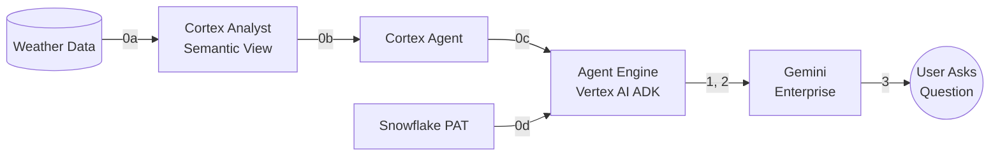

# Quickstart: Gemini Enterprise → Snowflake Cortex Agent via REST API

Contact: ali.khosro@snowflake.com

> **Short version:** See [demo.md](./demo.md) for a minimal 4-step guide.

This is the full, self-contained guide. Every code block is inline — no external script dependencies. It covers setup, deployment, verification, troubleshooting, and cleanup.

---

## Architecture



## Variables

| Variable | Value |
|----------|-------|
| `SNOWFLAKE_ACCOUNT` | `qn43380` |
| `SNOWFLAKE_REGION` | `us-central1.gcp` |
| `SNOWFLAKE_ACCOUNT_URL` | `https://qn43380.us-central1.gcp.snowflakecomputing.com` |
| `GCP_PROJECT` | `snowflake-corp-pse-poc` |
| `GCP_LOCATION` | `us-central1` |
| `CORTEX_AGENT_NAME` | `NY_WEATHER_AGENT` |
| `AGENT_DATABASE` | `poc` |
| `AGENT_SCHEMA` | `ai` |
| `SEMANTIC_VIEW` | `WEATHER_MAN` |
| `USER_ROLE` | `POC` |
| `AGENT_RUN_ENDPOINT` | `/api/v2/databases/poc/schemas/ai/agents/NY_WEATHER_AGENT:run` |

---

# Part 0: Snowflake Prerequisites

## 0a. Get Weather Data

1. Snowflake Marketplace → search **"Weather Source LLC - Frostbyte"** → get the listing
2. It creates database `WEATHER_SOURCE_LLC_FROSTBYTE` with view `ONPOINT_ID.HISTORY_DAY`
3. Create a filtered table for NY daily weather:

```sql
CREATE DATABASE IF NOT EXISTS poc;
CREATE SCHEMA IF NOT EXISTS poc.weather;

CREATE OR REPLACE TABLE poc.weather.ny_daily AS
SELECT postal_code, country, date_valid_std,
       avg_temperature_air_2m_f, avg_humidity_relative_2m_pct,
       avg_wind_speed_10m_mph, tot_precipitation_in,
       tot_snowfall_in, avg_cloud_cover_tot_pct
FROM WEATHER_SOURCE_LLC_FROSTBYTE.ONPOINT_ID.HISTORY_DAY
WHERE country = 'US' AND postal_code LIKE '1%';
```

4. Verify:

```sql
SELECT COUNT(*) FROM poc.weather.ny_daily;
SELECT * FROM poc.weather.ny_daily LIMIT 5;
```

## 0b. Create Cortex Analyst Semantic View

1. Snowsight → **AI & ML** → **Cortex Analyst** → **Create Semantic View**
2. Select table `POC.WEATHER.NY_DAILY`, name it `POC.AI.WEATHER_MAN`
3. Review generated column descriptions and save

Verify:

```sql
USE ROLE POC;
SHOW SEMANTIC VIEWS IN SCHEMA poc.ai;
```

## 0c. Create Cortex Agent

1. Snowsight → **AI & ML** → **Cortex Agents** → **Create Agent**
2. Name: `NY_WEATHER_AGENT`, Database: `POC`, Schema: `AI`
3. Add tool: **Cortex Analyst** → select `WEATHER_MAN` semantic view
4. Add sample questions: "What was the hottest day in 2021?", "What was the average temperature in January 2020?"
5. Save

Verify:

```sql
USE ROLE POC;
SHOW AGENTS IN SCHEMA poc.ai;
DESCRIBE AGENT poc.ai.NY_WEATHER_AGENT;
```

Optional — test in Snowsight UI: go to **AI & ML** → **Agents** → **NY_WEATHER_AGENT** → ask "What was the hottest day in 2021?" → expect June 29, 2021, 87.9°F.

> **Note:** There is no SQL function to call a Cortex Agent — it is only accessible via REST API or Snowsight UI.

## 0d. Create Programmatic Access Token (PAT)

1. Snowsight → **user avatar** (bottom left) → **Profile** → **Programmatic Access Tokens**
2. **+ Generate New Token**
   - Comment: `GE REST API POC`
   - Role: `POC`
   - Expiration: 30 days
3. Click **Generate**
4. **Copy and save the token immediately** — it won't be shown again

---

# Part 1: Test Cortex Agent REST API

Before deploying to Agent Engine, verify the REST API works directly.

## 1a. Test with curl

```bash
SNOWFLAKE_ACCOUNT_URL="https://qn43380.us-central1.gcp.snowflakecomputing.com"
AGENT_RUN_ENDPOINT="/api/v2/databases/poc/schemas/ai/agents/NY_WEATHER_AGENT:run"
PAT_TOKEN="<YOUR_PAT_TOKEN>"

curl -X POST "${SNOWFLAKE_ACCOUNT_URL}${AGENT_RUN_ENDPOINT}" \
  -H "Content-Type: application/json" \
  -H "Authorization: Bearer ${PAT_TOKEN}" \
  -H "Accept: application/json" \
  -d '{
    "messages": [
      {
        "role": "user",
        "content": [
          {
            "type": "text",
            "text": "What was the hottest day in 2021?"
          }
        ]
      }
    ],
    "stream": false
  }'
```

**Expected:** HTTP 200 with JSON containing "June 29, 2021" and "87.9°F".

## 1b. Test with Python

```bash
pip install requests
```

```python
import os, requests

SNOWFLAKE_ACCOUNT_URL = "https://qn43380.us-central1.gcp.snowflakecomputing.com"
AGENT_RUN_ENDPOINT = "/api/v2/databases/poc/schemas/ai/agents/NY_WEATHER_AGENT:run"
PAT_TOKEN = os.environ.get("PAT_TOKEN", "<YOUR_PAT_TOKEN>")

resp = requests.post(
    f"{SNOWFLAKE_ACCOUNT_URL}{AGENT_RUN_ENDPOINT}",
    headers={
        "Content-Type": "application/json",
        "Authorization": f"Bearer {PAT_TOKEN}",
        "Accept": "application/json",
    },
    json={
        "messages": [
            {"role": "user", "content": [{"type": "text", "text": "What was the hottest day in 2021?"}]}
        ],
        "stream": False,
    },
)
print(f"Status: {resp.status_code}")
if resp.status_code == 200:
    for item in resp.json().get("content", []):
        if item.get("type") == "text":
            print(f"Answer: {item['text']}")
else:
    print(f"Error: {resp.text}")
```

**Expected:** `Status: 200` and the correct answer.

---

# Part 2: Deploy Agent to Vertex AI Agent Engine

## 2a. GCP Prerequisites

```bash
gcloud auth application-default login --project=snowflake-corp-pse-poc
gcloud services enable aiplatform.googleapis.com --project=snowflake-corp-pse-poc
gsutil mb -l us-central1 -p snowflake-corp-pse-poc gs://snowflake-corp-pse-poc-agent-staging
pip install google-adk google-cloud-aiplatform requests
```

## 2b. Deploy the ADK Agent

```bash
export SNOWFLAKE_PAT="<your PAT from step 0d>"
```

```python
import os

GCP_PROJECT = os.environ.get("GCP_PROJECT", "snowflake-corp-pse-poc")
GCP_LOCATION = os.environ.get("GCP_LOCATION", "us-central1")
GCS_STAGING_BUCKET = os.environ.get("GCS_STAGING_BUCKET", "gs://snowflake-corp-pse-poc-agent-staging")

_SNOWFLAKE_URL = "https://qn43380.us-central1.gcp.snowflakecomputing.com/api/v2/databases/poc/schemas/ai/agents/NY_WEATHER_AGENT:run"
_SNOWFLAKE_PAT = os.environ.get("SNOWFLAKE_PAT", "")


def ask_snowflake(question: str) -> str:
    """Sends a natural-language question to the Snowflake Cortex Agent
    and returns the answer about NY weather data.

    Args:
        question: The user's natural-language question about New York weather.

    Returns:
        The answer from the Snowflake Cortex Agent.
    """
    import requests
    resp = requests.post(
        _SNOWFLAKE_URL,
        headers={
            "Content-Type": "application/json",
            "Authorization": f"Bearer {_SNOWFLAKE_PAT}",
            "Accept": "application/json",
        },
        json={
            "messages": [
                {"role": "user", "content": [{"type": "text", "text": question}]}
            ],
            "stream": False,
        },
        timeout=120,
    )
    if resp.status_code != 200:
        return f"Error calling Snowflake: {resp.status_code} - {resp.text}"
    result = resp.json()
    for item in result.get("content", []):
        if item.get("type") == "text":
            return item["text"]
    return f"No text answer in response: {result}"


from google.adk.agents import Agent
import google.cloud.aiplatform as aiplatform
import vertexai
from vertexai import agent_engines

aiplatform.init(project=GCP_PROJECT, location=GCP_LOCATION, staging_bucket=GCS_STAGING_BUCKET)
vertexai.init(project=GCP_PROJECT, location=GCP_LOCATION, staging_bucket=GCS_STAGING_BUCKET)

agent = Agent(
    model="gemini-2.5-flash",
    name="snowflake_weather_agent",
    instruction=(
        "You answer questions about New York weather data stored in Snowflake. "
        "When a user asks a weather-related question, call the ask_snowflake tool with their exact question. "
        "Return the answer from the tool directly. Do not make up data. "
        "If the question is not about New York weather, politely say you can only answer weather questions."
    ),
    tools=[ask_snowflake],
)

print(f"Deploying to {GCP_PROJECT} / {GCP_LOCATION}...")
remote_agent = agent_engines.create(
    agent_engine=agent,
    requirements=["google-adk", "requests"],
    display_name="Snowflake Weather Agent",
    description="Answers questions about NY weather by calling the Snowflake Cortex Agent REST API.",
)

print(f"\nResource name: {remote_agent.resource_name}")
print("Use this in GE Admin Console -> Agent Engine")
```

Deployment takes 3-8 minutes. Note the **Resource name** — you need it for step 3.

> **Important:** The PAT is captured from the `SNOWFLAKE_PAT` env var at deploy time via `cloudpickle` and baked into the deployed agent. It is available inside the Agent Engine container at runtime. No Secret Manager needed for POC.

> **Important:** `staging_bucket` must be passed to **both** `aiplatform.init()` and `vertexai.init()` — omitting either causes silent failures.

## 2c. Verify Deployed Agent

### List deployed agents

```python
import vertexai
from vertexai import agent_engines

vertexai.init(project="snowflake-corp-pse-poc", location="us-central1")
engines = sorted(agent_engines.list(), key=lambda e: e.create_time, reverse=True)
for e in engines:
    print(f"  {e.create_time}  {e.resource_name}  {e.display_name}")
```

### Test the most recent agent

```python
agent = engines[0]
session = agent.create_session(user_id="verify-test")
response = agent.stream_query(
    user_id="verify-test",
    session_id=session["id"],
    message="What was the hottest day in 2021?",
)
output = ""
for event in response:
    output += str(event)

if output.strip():
    print(f"Answer: {output}")
    print("PASS")
else:
    print(f"FAILED — no answer. Response:\n{output}")
```

**Expected:** Answer containing "June 29, 2021" and "87.9°F".

If you get an IP-related error, proceed to step 2d.

## 2d. Whitelist Agent Engine IP in Snowflake (if needed)

Agent Engine egress IPs are **not** in standard GCP ranges (34.x/35.x). They come from ranges like `136.124.x.x`. When the agent is blocked, the error message contains the blocked IP.

```sql
USE ROLE ACCOUNTADMIN;
CREATE OR REPLACE NETWORK RULE admin_db.network.agent_engine_rule
  MODE = INGRESS TYPE = IPV4 VALUE_LIST = ('<IP>/16')
  COMMENT = 'Google Agent Engine egress IPs';

ALTER NETWORK POLICY <YOUR_POLICY>
  ADD ALLOWED_NETWORK_RULE_LIST = ('ADMIN_DB.NETWORK.AGENT_ENGINE_RULE');
```

Replace `<IP>` with the IP from the error and `<YOUR_POLICY>` with your account's network policy (e.g. `ACCOUNT_VPN_POLICY_SE`).

Then re-run the verify step (2c).

> **Note:** If your account has an automated network policy task (like a security team's `CREATE OR REPLACE NETWORK POLICY` on a schedule), your rule will be wiped on each run. See `plan.md` for workarounds.

---

# Part 3: Register in Gemini Enterprise

## 3a. Create Agent in GE Admin Console

1. Go to [Google Admin Console](https://admin.google.com)
2. Navigate to **Apps** → **Google Workspace** → **Gemini** → **Agents**
3. Click **Create Agent** → select **Agent Engine (Vertex AI)**
4. **Reasoning Engine source:** paste the resource name from step 2b
   ```
   projects/138540327209/locations/us-central1/reasoningEngines/<YOUR_ID>
   ```
5. **Skip Agent Authorization** — OAuth is NOT needed (PAT is baked into the agent)
6. Set **Name** and **Description**
7. Go to **User Permissions** tab → add yourself and/or your org
8. **Save**

> **Why skip OAuth?** GE sends the OAuth authorize redirect without `response_type=code` (required by RFC 6749). Snowflake rejects it. This is a confirmed GE-side bug. The deployed agent handles Snowflake auth internally via the baked-in PAT, so GE Agent Authorization is unnecessary. See `oauth-test.md` for the standalone proof.

## 3b. End-to-End Test

Open **gemini.google.com** or the Gemini side panel in any Google Workspace app.

| # | Question | Expected Answer |
|---|----------|-----------------|
| 1 | "What was the hottest day in 2021?" | June 29, 2021, 87.9°F |
| 2 | "What was the average temperature in January 2020?" | A numeric temperature answer |
| 3 | "Tell me a joke" | Agent says it can only answer weather questions |

If GE doesn't auto-route to your agent, try **@your-agent-name What was the hottest day in 2021?**

---

# Troubleshooting

## Snowflake Errors

| Issue | Solution |
|-------|----------|
| `401 Unauthorized` from curl/Python | PAT is invalid or expired — regenerate in Snowsight |
| `403 Not Authorized` | Role lacks `SNOWFLAKE.CORTEX_USER` or `USAGE` on agent |
| `404 Not Found` | Check endpoint URL — database, schema, agent name are case-sensitive |
| `400 missing execution environment` | Agent needs a warehouse. Run: `ALTER USER <user> SET DEFAULT_WAREHOUSE = 'COMPUTE_WH'` or add `execution_environment` to agent spec |
| IP blocked by network policy | Extract IP from error, whitelist with network rule (step 2d) |

## Agent Engine Errors

| Issue | Solution |
|-------|----------|
| Model `404 NOT_FOUND` | Verify `aiplatform.googleapis.com` is enabled; use `gemini-2.5-flash` (not `gemini-2.0-flash`) |
| `staging_bucket` error | Pass to **both** `aiplatform.init()` and `vertexai.init()` |
| Agent deploys but returns empty | Check logs: `gcloud logging read 'resource.type="aiplatform.googleapis.com/ReasoningEngine" AND severity>=ERROR' --project=snowflake-corp-pse-poc --limit=5 --format=json` |
| Old pickle after code change | Each `agent_engines.create()` makes a **new** engine — use the latest resource ID |
| `DefaultCredentialsError` | Run `gcloud auth application-default login --project=snowflake-corp-pse-poc` first |

## Gemini Enterprise Errors

| Issue | Solution |
|-------|----------|
| GE shows "thinking" then nothing | Check Agent Engine logs for model or network errors |
| GE doesn't route to agent | Try `@agent-name <question>` or check User Permissions |
| OAuth `response_type` error | Known GE bug — skip Agent Authorization entirely |

---

# What Did NOT Work

| Approach | Issue |
|----------|-------|
| **MCP** | Snowflake MCP uses JSON-RPC/HTTPS; GE expects Streamable HTTP — incompatible protocols |
| **GE Custom Actions** | Deprecated March 2026 — UI redirects to data connectors that don't support arbitrary REST |
| **GE Agent Authorization (OAuth)** | GE omits `response_type=code` in OAuth redirect; Snowflake rejects it. Not needed anyway |
| **`gemini-2.0-flash` model** | 404 in the GCP project — use `gemini-2.5-flash` instead |

See `feasibility-study.md` for the full comparison matrix.

---

# Cleanup

## Delete Old Reasoning Engines

```python
import vertexai
from vertexai import agent_engines

vertexai.init(project="snowflake-corp-pse-poc", location="us-central1")
for engine in agent_engines.list():
    if engine.resource_name != "projects/138540327209/locations/us-central1/reasoningEngines/<KEEP_THIS_ID>":
        engine.delete()
        print(f"Deleted {engine.resource_name}")
```

## Revoke PAT

Snowsight → Profile → Programmatic Access Tokens → Delete the POC token.

## Remove Network Rule

```sql
USE ROLE ACCOUNTADMIN;
ALTER NETWORK POLICY ACCOUNT_VPN_POLICY_SE
  REMOVE ALLOWED_NETWORK_RULE_LIST = ('ADMIN_DB.NETWORK.AGENT_ENGINE_RULE');
DROP NETWORK RULE ADMIN_DB.NETWORK.AGENT_ENGINE_RULE;
```

## Deactivate GE Agent

GE Admin Console → Agents → Deactivate or delete the agent.
