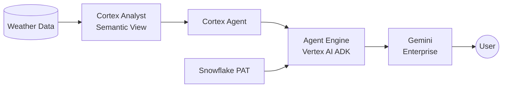

# Requirements: Gemini Enterprise Calls Snowflake Cortex Agent via REST API

## Variables

| Variable | Value | Description |
|----------|-------|-------------|
| SNOWFLAKE_ACCOUNT | qn43380 | Snowflake account identifier |
| SNOWFLAKE_REGION | us-central1.gcp | Account region |
| SNOWFLAKE_ACCOUNT_URL | https://qn43380.us-central1.gcp.snowflakecomputing.com | Full account URL |
| GCP_PROJECT | snowflake-corp-pse-poc | GCP project ID |
| CORTEX_AGENT_NAME | NY_WEATHER_AGENT | Existing Cortex Agent |
| AGENT_DATABASE | poc | Agent database |
| AGENT_SCHEMA | ai | Agent schema |
| SEMANTIC_VIEW | WEATHER_MAN | Semantic view used by agent |
| USER_ROLE | POC | Snowflake role for access |
| REASONING_ENGINE_ID | 4700720621753991168 | Deployed Agent Engine resource |

---

## Product Vision

As a **product owner**, I want enterprise users who work in Gemini Enterprise (GE) to ask natural-language questions about data stored in Snowflake and get answers — without leaving GE, without knowing SQL, and without managing any infrastructure.

## User Story

> As a business analyst using Gemini Enterprise,
> I want to ask "What was the hottest day in NYC in 2021?"
> and receive the answer directly in my GE conversation,
> so that I can get data-driven answers without switching tools.

## What We're Building

A **Vertex AI Agent Engine agent** deployed via the Google ADK Python SDK, registered in Gemini Enterprise. The agent has a single tool function (`ask_snowflake`) that calls the **Snowflake Cortex Agent `:run` REST API** using a PAT baked into the deployed agent pickle. When a user asks a data question in GE, it routes to the Agent Engine agent, which calls the Cortex Agent, and returns the answer.

> **Note:** GE Custom Actions were deprecated (March 2026). Agent Engine via ADK Python SDK is the working path for custom agent integrations in GE.

## Architecture (What Worked)

## Functional Requirements

| # | Requirement | Priority | Status |
|---|------------|----------|--------|
| FR-1 | User asks a natural-language question in GE and receives an answer from Snowflake data | Must | **Done** |
| FR-2 | The integration uses the existing Cortex Agent (NY_WEATHER_AGENT) — no new agent needed | Must | **Done** |
| FR-3 | Responses include the data answer in plain text | Must | **Done** |
| FR-4 | Multi-turn conversation is supported (follow-up questions) | Should | Supported via ADK sessions |
| FR-5 | If the agent cannot answer, it returns a clear "I don't know" message | Should | **Done** — agent instructions handle this |

## Non-Functional Requirements

| # | Requirement | Priority | Status |
|---|------------|----------|--------|
| NFR-1 | Response time under 15 seconds for typical queries | Should | ~20s (includes Cortex Agent + Gemini) |
| NFR-2 | Authentication uses Snowflake PAT baked into deployed agent | Must | **Done** |
| NFR-3 | Minimal middleware — Agent Engine agent with one tool function | Should | **Done** |
| NFR-4 | RBAC enforced: user's Snowflake role determines data access | Must | PAT is scoped to POC role |

## Authentication (What Actually Worked)

- **PAT** baked into the ADK agent's Python closure at deploy time via `cloudpickle`
- The PAT is set as an env var locally, captured in the pickle, and available in the Agent Engine container
- **OAuth was not needed** — GE Agent Engine's "Agent Authorization" (client_id, client_secret, token_uri, auth_uri) is optional and can be skipped
- For production: consider GCP Secret Manager integration or OAuth token rotation

## What's In Scope

- Agent Engine agent deployed via ADK Python SDK with `ask_snowflake` tool
- Snowflake PAT for POC auth
- Network policy update to allow Agent Engine IP
- End-to-end test: question in GE → answer from Snowflake

## What's Out of Scope

- MCP integration (evaluated and rejected — see feasibility-study.md)
- GE Custom Actions (deprecated March 2026 — see feasibility-study.md)
- GE Agent Authorization via OAuth (attempted, not required — see feasibility-study.md)
- Web UI or custom frontend
- Multi-agent orchestration
- Production EntraID setup (separate concern)

## Success Criteria

| # | Criterion | Status |
|---|-----------|--------|
| 1 | User in GE asks "What was the hottest day in 2021?" and gets June 29, 2021, 87.9°F | **PASS** |
| 2 | Call flows: GE → Agent Engine (gemini-2.5-flash) → Cortex Agent REST API | **PASS** |
| 3 | Auth uses PAT | **PASS** |
| 4 | Total implementation time: 3-4 days | ~1 day (with troubleshooting) |
