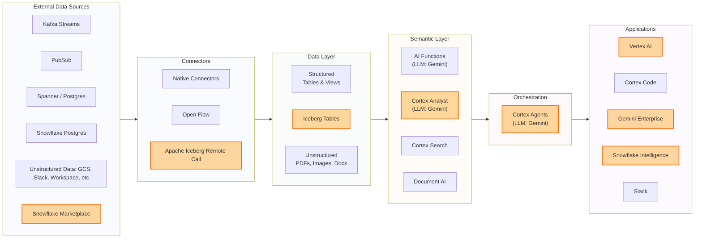
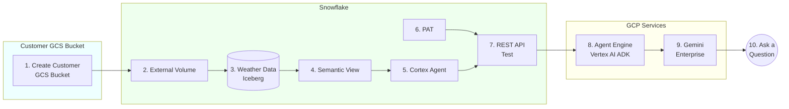

## Snowflake Cortex Platform

 Highlighted nodes are covered in today's demo

### Why Cortex?

| | Advantage | How |
|---|---|---|
| **Accuracy** | Less hallucination, business-grade answers | Full visibility into metadata, query history, table relationships. Adaptive semantic views continuously learn your business logic. |
| **Security** | Data never leaves Snowflake | Only insights travel to the end application. No copies, no extracts, no exposure. |
| **Cost & Speed** | No data movement, no egress charges | Compute runs next to the data. Less movement = lower cost + faster responses. |

## Today's Demo — End-to-End Flow

**Flow:** Marketplace Data → Iceberg Table → Cortex Analyst → Cortex Agent → Snowflake Intelligence + Gemini Enterprise

**Result:** Business users ask plain English questions, get answers from Snowflake data, no SQL required.

### Demo Highlights

| What We Show | Why It Matters |
|-------------|----------------|
| **Cortex works with Iceberg** | Data stays in the customer's own GCS bucket. Snowflake manages it, customer owns the storage. |
| **Semantic view adapts** | Learns from business logic, query history, data context, and metadata. Delivers high accuracy answers with less hallucination. |
| **Powered by Gemini** | Cortex Analyst and Cortex Agents use Google's newest Gemini models as their LLM. |
| **Vertex AI integrates with Cortex** | Agent Engine (ADK) calls Cortex Agent's REST API, bridging GCP and Snowflake natively. |
| **Gemini Enterprise uses Cortex Agents** | Registers the deployed Agent Engine and routes user questions to Cortex Agents seamlessly. |
| **Only insights travel, data stays put** | No data movement, no egress. High security, lower cost, faster responses. |
