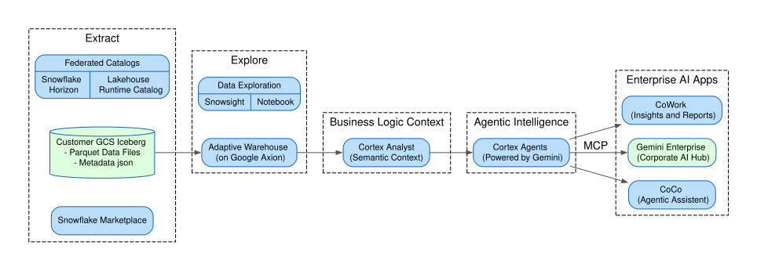

# AI-Ready Open Lakehouse: Snowflake Cortex + Gemini Enterprise

A hands-on lab that builds an AI-ready data product on Apache Iceberg — from raw Marketplace data to a Cortex Agent consumed by Snowflake CoWork, Gemini Enterprise (via MCP), and Looker dashboards. One copy of data, one agent, many surfaces.

This lab loosely follows the architecture described in [blog-post.md](./assets/blog-post.md).

If you are looking for how to set up MCP connection between Snowflake Cortex and Gemini Enterprise, see the [MCP guide](./mcp-server-setup-guide.md).

## What You Build

1. **Iceberg table** on your GCS bucket from Snowflake Marketplace economic data (BLS, Freddie Mac, IRS)
2. **Semantic View** defining dimensions, facts, and metrics — business logic in the data layer
3. **Cortex Agent** powered by Gemini that turns natural-language questions into governed SQL
4. **MCP Server + OAuth** exposing the agent to any MCP-compatible client
5. **Gemini Enterprise** data connector consuming the agent natively
6. **Looker dashboard** on the same Iceberg data — BI alongside AI chat

## Run the Lab

Open **`hol-cortex-gemini.ipynb`** in a Snowflake Workspace and run cells top-to-bottom. The notebook is self-contained — narration, code, and UI pointers all in one place.

New to the environment setup? Start with the [how-to setup video](./assets/how-to-setup-gcp-snowflake-workshop.mov).

## Contribute

- main-prompt is human input only, it helps ai to create narration
- narration should be reviewed and confirmed by human. main prompt sets the tone and story.
- based on narration and main prompt, ai created how-to wich included UI pointers and code blocks.
- you can provide proofreads input for the final outcome.

### Root files

| File | Purpose |
|------|---------|
| `hol-cortex-gemini.ipynb` | **The lab notebook** — run this. Source of truth for all SQL. |
| `quickstart-iceberg-cortex-gemini.md` | Self-service quickstart (Snowflake sfguide format), derived from the notebook |
| `how-to.md` | Workshop how-to with UI pointers and code blocks |
| `mcp-server-setup-guide.md` | Gemini Enterprise MCP connection to Snowflake Cortex |
| `main-prompt.md` | Human-written input prompt used to guide AI content generation |
| `narration.md` | Pure narrative text for each section (no code, no UI) |
| `proofreads.md` | Feedback and iteration notes — edit this to give AI direction |
| `README.md` | This file |

### `assets/`

| File | Purpose |
|------|---------|
| `arch-diagram.svg` | Architecture diagram. The only asset referenced by the published quickstart. |
| `blog-post.md` | Conceptual blog post explaining the architecture and "why" — the narrative source this lab implements |
| `diagrams.md` | Graphviz DOT source for the architecture diagram, plus the notebook's diagram helper code |
| `how-to-setup-gcp-snowflake-workshop.mov` | Environment setup walkthrough video (stored via git-lfs — see `.gitattributes`) |

> **Note on publishing:** when copying this guide into `Snowflake-Labs/sfquickstarts`, only `quickstart-iceberg-cortex-gemini.md` and `assets/arch-diagram.svg` should ship. Non-image assets are not uploaded to snowflake.com, so anything else the guide references must be linked from GitHub instead.

## Prerequisites

- Snowflake account (provided via DataOps registration for workshops)
- Google Cloud lab environment (Qwiklabs)
- ~75 minutes
