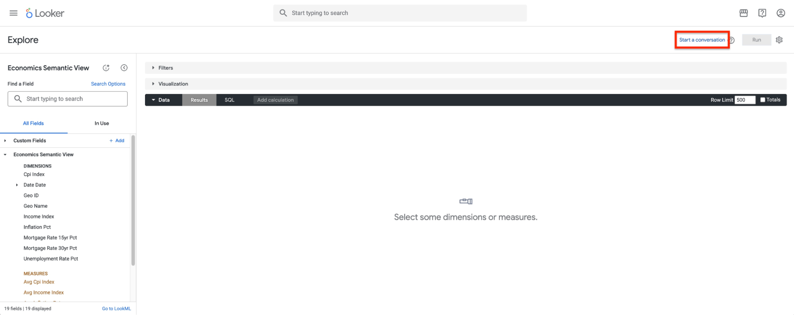
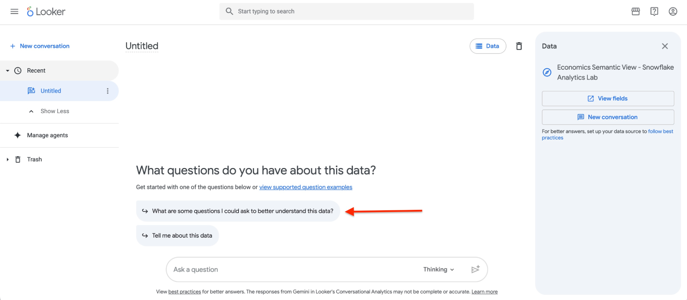
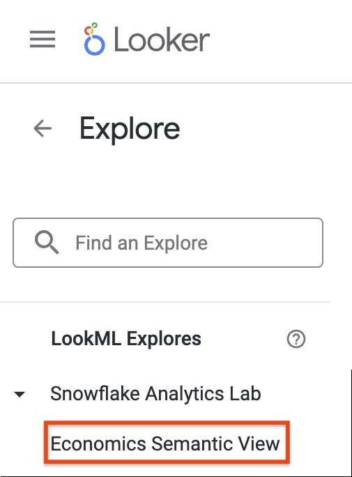
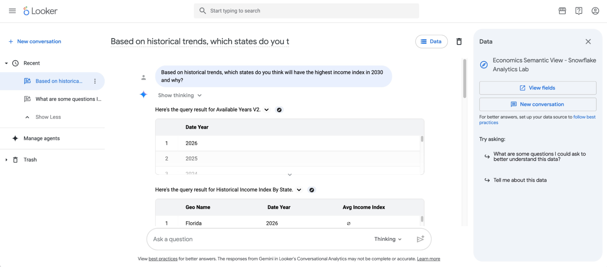
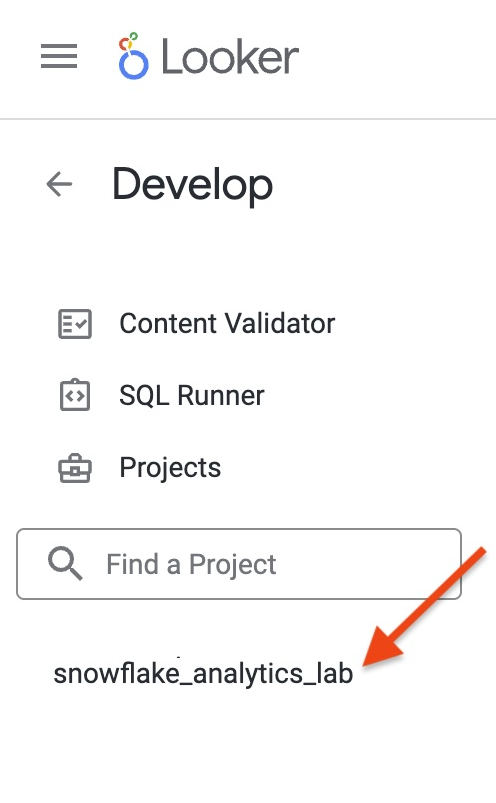

**Hands on Lab:**  
**Snowflake Analytics**  
**Conversational Analytics with Looker**

# Chatting with the Snowflake Semantic View Using Looker Conversational Analytics

### Task \#1 \- Log Into Looker

You’ll use the following information to connect:  
**URL**: [https://lookerhandsonlab.cloud.looker.com/](https://lookerhandsonlab.cloud.looker.com/)  
**User Name:** lookerlabstudent+\<Your Lab User Number\>@gmail.com  
**Password:** 4Analytics\_\<Your Lab User Number\>  
Check the box next to “Stay Logged In”

For example, if you were Lab User \#268, you would log in with the following credentials:  
**User Name:** lookerlabstudent+268@gmail.com  
**Password:** 4Analytics\_268  
Check the box next to “Stay Logged In”

### Task \#2 \- Create a Database Connection

Before we can work with the data in our database, we need to create a database connection in Looker to your Snowflake warehouse, if one does not already exist.  Looker communicates with all supported databases using JDBC.  Creating and managing database connections is an Administrative function in Looker, and lab users won’t have access to the Admin functionality.  The instructor will demonstrate how a new connection is created.  For this lab, we will all be sharing a connection named *snowflake\_analytics\_hol*, which has already been created for you.

You can find more information about creating and managing database connections in Looker here:  
[https://docs.looker.com/setup-and-management/connecting-to-db](https://docs.looker.com/setup-and-management/connecting-to-db)

### Task \#3 \- Create a Looker Project

A project is a collection of files that describe the objects, connections, and user interface elements that will be used to carry out SQL queries for your Looker users. Lab users will not have permissions to create a new Project.  The instructor will demonstrate how a new Project is created.  For this lab, we will all be sharing a project named *snowflake\_analytics\_hol\_lab*, which has already been created for you.

You can find more information about Looker Projects here:  
[https://docs.looker.com/data-modeling/getting-started/how-project-works](https://docs.looker.com/data-modeling/getting-started/how-project-works)

### Task \#4 \- Examine the LookML Files

To access the LookML files for this project, select “Develop” from the main menu and then select the name of the project that you’d like to work with from the list.  Select the project “snowflake\_analytics\_lab”.

Explore the types of files in the Looker Project.  There are two types of LookML files generated:

**Model File:** This file lists all of the tables that will be used in the project, and the join relationship between those tables.  The tables are grouped into *explores*, which are used for logically grouping tables together that can help answer questions about a specific business concept.  Designing explores so that users can get access to the data that they need to answer their questions without being overwhelmed with other data that is not relevant to their business needs is an important part of the job of a Looker Data Analyst.

**View File**: Not to be confused with a database view, a Looker View file describes the columns in a database table, database view and for Snowflake, Semantic Views are also supported.  They can also describe a Looker Derived Table or a Looker Persistent Derived Table, but we will not be covering those in the lab.  

### Task \#5 \- Looker’s Explore Interface

Users access Looker’s Explore Interface for doing their own data exploration as well as creating their own reports and dashboards.  This is also one of several ways to access Looker’s Conversational Analytics interface.

Access the Explore Interface by choosing Explore from the main menu, and then clicking on the “Economics Semantic View” explore  under “Snowflake Analytics Lab”.

Notice that “Snowflake Analytics Lab” corresponds to the name of your Model File and “Economics Semantic View” corresponds to the name of the explore within the Model File.

On the left side of the Explore Interface is the Field Picker.  This is where users can select the dimensions and measures that they want to appear in their report or dashboard tile.  
For this lab, we will be using the Conversational Analytics interface instead.  The advantage of accessing the Conversational Analytics interface through the Explore Interface is that the context for Conversational  Analytics will already be set to the same Looker Explore.  Click on “Start a conversation” on the top right to open the Conversational Analytics interface.

### Task \#6 \- Talk To Your Data

Conversational Analytics in Looker allows you to interact with your data just by typing in questions.  The context of your conversation is displayed in the panel on the right side of the screen.  You can see that the current context is the Economics Semantic View explore within the Snowflake Analytics Lab project.

Conversations are  multi-turn, meaning you can ask a series of questions and the state of your conversation will be retained.  Here’s an example of a conversation where the context of the previous question is used as the input to the followup question:

* What was the annual unemployment rate in the United States for 2025?  
* Can you break that down by month?  
* Can you show that as a bar chart?

When you are ready to move on to a new topic, click the “New Conversation” button on the right.

To learn about the data that is available, you can ask Conversation Analytics for some ideas using natural language.  There will already be some starter questions populated for you, so click on one of them to find out more about the data and the types of questions that you might want to ask.

### Task \#7 \- Ask your own questions

Using some of the questions provided in the previous step, test Conversational Analytics out for yourself.  Feel free to think of some of your own questions as well.  Remember to click the “New Conversation” button on the right when you are ready to move on to a new topic.  

