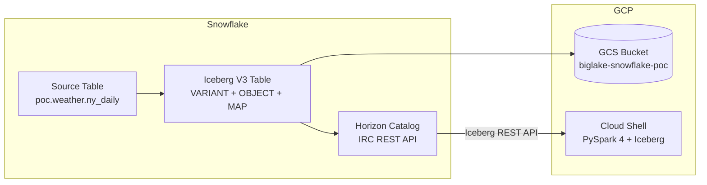

# TravelPass POC: Iceberg V3 with VARIANT, OBJECT, and MAP Types

## Overview
This quickstart demonstrates Snowflake Horizon-managed Iceberg V3 tables with three semi-structured column types:
- **VARIANT** - Flexible JSON-like data
- **OBJECT** - Structured key-value pairs
- **MAP(VARCHAR, VARCHAR)** - Typed key-value mapping

All three columns contain the same weather summary data for comparison.

## Architecture



---

## Part 1: Snowflake Setup

### 1.1 Configuration Variables

```sql
SET var_role = 'POC';
SET var_warehouse = 'COMPUTE_WH';
SET var_external_volume = 'biglake_gcs_volume';
SET var_source_table = 'poc.weather.ny_daily';
SET var_iceberg_database = 'ICEBERG_POC';
SET var_iceberg_schema = 'TRAVELPASS';
SET var_iceberg_table = 'WEATHER_TYPES';
SET var_iceberg_base_location = 'travelpass/weather_types/';

SET var_iceberg_full_table = $var_iceberg_database || '.' || $var_iceberg_schema || '.' || $var_iceberg_table;
SET var_iceberg_full_schema = $var_iceberg_database || '.' || $var_iceberg_schema;
```

### 1.2 Setup Context

```sql
USE ROLE IDENTIFIER($var_role);
USE WAREHOUSE IDENTIFIER($var_warehouse);
```

### 1.3 Create Database and Schema

```sql
CREATE DATABASE IF NOT EXISTS IDENTIFIER($var_iceberg_database);
CREATE SCHEMA IF NOT EXISTS IDENTIFIER($var_iceberg_full_schema);

USE DATABASE IDENTIFIER($var_iceberg_database);
USE SCHEMA IDENTIFIER($var_iceberg_schema);
```

### 1.4 Check Source Table

```sql
DESCRIBE TABLE IDENTIFIER($var_source_table);
SELECT * FROM IDENTIFIER($var_source_table) LIMIT 5;
```

### 1.5 Create Iceberg V3 Table with VARIANT, OBJECT, and MAP

```sql
CREATE OR REPLACE ICEBERG TABLE IDENTIFIER($var_iceberg_full_table)
  CATALOG = 'SNOWFLAKE'
  EXTERNAL_VOLUME = $var_external_volume
  BASE_LOCATION = $var_iceberg_base_location
  ICEBERG_VERSION = 3
  AS SELECT 
    POSTAL_CODE,
    COUNTRY,
    DATE_VALID_STD,
    
    AVG_TEMPERATURE_AIR_2M_F,
    AVG_HUMIDITY_RELATIVE_2M_PCT,
    AVG_WIND_SPEED_10M_MPH,
    TOT_PRECIPITATION_IN,
    
    -- VARIANT column: flexible semi-structured data
    TO_VARIANT(OBJECT_CONSTRUCT(
      'temp', AVG_TEMPERATURE_AIR_2M_F::VARCHAR,
      'wind', AVG_WIND_SPEED_10M_MPH::VARCHAR,
      'precip', TOT_PRECIPITATION_IN::VARCHAR,
      'humidity', AVG_HUMIDITY_RELATIVE_2M_PCT::VARCHAR
    )) AS weather_variant,
    
    -- OBJECT column: structured OBJECT with defined schema (required for Iceberg)
    OBJECT_CONSTRUCT(
      'temp', AVG_TEMPERATURE_AIR_2M_F::VARCHAR,
      'wind', AVG_WIND_SPEED_10M_MPH::VARCHAR,
      'precip', TOT_PRECIPITATION_IN::VARCHAR,
      'humidity', AVG_HUMIDITY_RELATIVE_2M_PCT::VARCHAR
    )::OBJECT(temp VARCHAR, wind VARCHAR, precip VARCHAR, humidity VARCHAR) AS weather_object,
    
    -- MAP(VARCHAR, VARCHAR) column: cast OBJECT to MAP
    OBJECT_CONSTRUCT(
      'temp', AVG_TEMPERATURE_AIR_2M_F::VARCHAR,
      'wind', AVG_WIND_SPEED_10M_MPH::VARCHAR,
      'precip', TOT_PRECIPITATION_IN::VARCHAR,
      'humidity', AVG_HUMIDITY_RELATIVE_2M_PCT::VARCHAR
    )::MAP(VARCHAR, VARCHAR) AS weather_map
    
  FROM IDENTIFIER($var_source_table);
```

### 1.6 Verify Table Schema

```sql
DESCRIBE TABLE IDENTIFIER($var_iceberg_full_table);
```

Expected output:
| Column | Type |
|--------|------|
| weather_variant | VARIANT |
| weather_object | OBJECT |
| weather_map | MAP(VARCHAR, VARCHAR) |


### 1.8 Test Data Access

```sql
SELECT 
    DATE_VALID_STD,
    
    -- Access VARIANT fields
    weather_variant:temp::VARCHAR AS variant_temp,
    weather_variant:wind::VARCHAR AS variant_wind,
    
    -- Access OBJECT fields
    weather_object:temp::VARCHAR AS object_temp,
    weather_object:wind::VARCHAR AS object_wind,
    
    -- Access MAP fields
    weather_map['temp'] AS map_temp,
    weather_map['wind'] AS map_wind
    
FROM IDENTIFIER($var_iceberg_full_table) 
LIMIT 5;
```

### 1.9 Row Count

```sql
SELECT COUNT(*) AS row_count FROM IDENTIFIER($var_iceberg_full_table);
```

---

## Part 2: PySpark 4 Read from GCP Cloud Shell

### 2.1 Check Available Spark Engines

Cloud Shell does NOT have Spark pre-installed. Run these checks first:

```bash
# Check if PySpark is already installed
pip show pyspark 2>/dev/null | grep Version || echo "PySpark not installed (expected)"

# Check Java version (required for Spark)
# java -version 2>&1 | head -1
```

**Install PySpark 4.x** (required for Iceberg V3 VARIANT support):

```bash
# pip install "pyspark>=4.0.0"
```

**Verify installation:**

```bash
# python3 -c "import pyspark; print(f'PySpark version: {pyspark.__version__}')"
# Expected output: PySpark version: 4.0.0
```

> **Note:** PySpark 4.0+ with Iceberg Runtime 1.10.1+ is required for Iceberg V3 VARIANT support.

### 2.2 Configuration Variables

```python
import time

# IMPORTANT: Replace underscore with hyphen for valid DNS hostname
SNOWFLAKE_ACCOUNT = "sfsenorthamerica-akhosro-gcp"
WAREHOUSE = "COMPUTE_WH"
DATABASE = "ICEBERG_POC"
NAMESPACE = "TRAVELPASS"
TABLE = "WEATHER_TYPES"
FULL_TABLE = f"{DATABASE}.{NAMESPACE}.{TABLE}"

# Note: Account name in URL must use hyphens (not underscores) for valid SSL
IRC_URI = f"https://{SNOWFLAKE_ACCOUNT}.snowflakecomputing.com/polaris/api/catalog"
PAT_TOKEN = ""

# Match Iceberg runtime to your PySpark version:
# - PySpark 4.0.x → iceberg-spark-runtime-4.0_2.13
# - PySpark 4.1.x → iceberg-spark-runtime-4.0_2.13 (same, 4.1 runtime not yet released)
ICEBERG_SPARK_RUNTIME = "org.apache.iceberg:iceberg-spark-runtime-4.0_2.13:1.10.1"
```

### 2.3 Initialize PySpark 4 with Iceberg

```python
from pyspark.sql import SparkSession

# Snowflake Horizon requires session:role scope
HORIZON_SESSION_ROLE = "session:role:POC"
REGION = "us-central1"  # GCS region where Iceberg data is stored

spark = SparkSession.builder \
    .appName("TravelPass-Iceberg-V3") \
    .config("spark.jars.packages", f"{ICEBERG_SPARK_RUNTIME},org.apache.iceberg:iceberg-gcp-bundle:1.10.1") \
    .config("spark.sql.extensions", "org.apache.iceberg.spark.extensions.IcebergSparkSessionExtensions") \
    .config("spark.sql.defaultCatalog", DATABASE) \
    .config(f"spark.sql.catalog.{DATABASE}", "org.apache.iceberg.spark.SparkCatalog") \
    .config(f"spark.sql.catalog.{DATABASE}.type", "rest") \
    .config(f"spark.sql.catalog.{DATABASE}.uri", IRC_URI) \
    .config(f"spark.sql.catalog.{DATABASE}.warehouse", DATABASE) \
    .config(f"spark.sql.catalog.{DATABASE}.credential", PAT_TOKEN) \
    .config(f"spark.sql.catalog.{DATABASE}.scope", HORIZON_SESSION_ROLE) \
    .config(f"spark.sql.catalog.{DATABASE}.client.region", REGION) \
    .config(f"spark.sql.catalog.{DATABASE}.header.X-Iceberg-Access-Delegation", "vended-credentials") \
    .config("spark.sql.iceberg.vectorization.enabled", "false") \
    .getOrCreate()

spark.sparkContext.setLogLevel("ERROR")
print(f"Spark version: {spark.version}")
print(f"Catalog configured: {DATABASE}")
```

### 2.4 List Tables

```python
print(f"\n=== Tables in {NAMESPACE} ===")
spark.sql(f"SHOW TABLES IN {DATABASE}.{NAMESPACE}").show()
```

### 2.5 Read Table Schema

```python
print(f"\n=== Schema of {FULL_TABLE} ===")
df = spark.table(FULL_TABLE)
df.printSchema()
```

Expected schema:
```
root
 |-- POSTAL_CODE: string
 |-- COUNTRY: string
 |-- DATE_VALID_STD: date
 |-- AVG_TEMPERATURE_AIR_2M_F: double
 |-- ...
 |-- WEATHER_VARIANT: variant
 |-- WEATHER_OBJECT: struct
 |-- WEATHER_MAP: map<string,string>
```

Expected schema:
```
root
 |-- POSTAL_CODE: string
 |-- COUNTRY: string
 |-- DATE_VALID_STD: date
 |-- AVG_TEMPERATURE_AIR_2M_F: double
 |-- ...
 |-- WEATHER_VARIANT: variant
 |-- WEATHER_OBJECT: struct
 |-- WEATHER_MAP: map<string,string>
```

### 2.6 Full Table Read with Performance Metrics

```python
print("\n=== [Cloud Shell] Full Table Read ===")
start_time = time.time()

df = spark.table(FULL_TABLE)
row_count = df.count()

read_latency_ms = (time.time() - start_time) * 1000
print(f"[Cloud Shell] Rows: {row_count}")
print(f"[Cloud Shell] Full table read latency: {read_latency_ms:.2f} ms")
print(f"[Cloud Shell] Throughput: {row_count / (read_latency_ms / 1000):.2f} rows/sec")
```

### 2.7 Access VARIANT Column

```python
print("\n=== [Cloud Shell] VARIANT Column Access ===")
start_time = time.time()

df_variant = spark.sql(f"""
    SELECT 
        DATE_VALID_STD,
        weather_variant,
        variant_get(weather_variant, '$.temp', 'string') AS temp,
        variant_get(weather_variant, '$.wind', 'string') AS wind,
        variant_get(weather_variant, '$.precip', 'string') AS precip,
        variant_get(weather_variant, '$.humidity', 'string') AS humidity
    FROM {FULL_TABLE}
    LIMIT 10
""")
df_variant.show(truncate=False)

variant_latency_ms = (time.time() - start_time) * 1000
print(f"[Cloud Shell] VARIANT extraction latency: {variant_latency_ms:.2f} ms")
```

### 2.8 Access OBJECT Column

```python
print("\n=== [Cloud Shell] OBJECT Column Access ===")
start_time = time.time()

df_object = spark.sql(f"""
    SELECT 
        DATE_VALID_STD,
        weather_object,
        weather_object.temp AS temp,
        weather_object.wind AS wind,
        weather_object.precip AS precip,
        weather_object.humidity AS humidity
    FROM {FULL_TABLE}
    LIMIT 10
""")
df_object.show(truncate=False)

object_latency_ms = (time.time() - start_time) * 1000
print(f"[Cloud Shell] OBJECT extraction latency: {object_latency_ms:.2f} ms")
```

### 2.9 Access MAP Column

```python
print("\n=== [Cloud Shell] MAP Column Access ===")
start_time = time.time()

df_map = spark.sql(f"""
    SELECT 
        DATE_VALID_STD,
        weather_map,
        weather_map['temp'] AS temp,
        weather_map['wind'] AS wind,
        weather_map['precip'] AS precip,
        weather_map['humidity'] AS humidity
    FROM {FULL_TABLE}
    LIMIT 10
""")
df_map.show(truncate=False)

map_latency_ms = (time.time() - start_time) * 1000
print(f"[Cloud Shell] MAP extraction latency: {map_latency_ms:.2f} ms")
```

### 2.10 Compare All Three Types

```python
print("\n=== [Cloud Shell] Type Comparison ===")

df_compare = spark.sql(f"""
    SELECT 
        DATE_VALID_STD,
        variant_get(weather_variant, '$.temp', 'string') AS variant_temp,
        weather_object.temp AS object_temp,
        weather_map['temp'] AS map_temp
    FROM {FULL_TABLE}
    LIMIT 5
""")
df_compare.show(truncate=False)
```

### 2.11 Performance Summary

```python
print("\n=== Performance Summary ===")
print(f"Full table read:     {read_latency_ms:.2f} ms")
print(f"VARIANT extraction:  {variant_latency_ms:.2f} ms")
print(f"OBJECT extraction:   {object_latency_ms:.2f} ms")
print(f"MAP extraction:      {map_latency_ms:.2f} ms")
```

### 2.12 Cleanup Spark Session

```python
spark.stop()
print("Spark session stopped")
```

---

## Part 3: Cleanup (Optional)

```sql
USE ROLE IDENTIFIER($var_role);
DROP TABLE IF EXISTS IDENTIFIER($var_iceberg_full_table);
DROP SCHEMA IF EXISTS IDENTIFIER($var_iceberg_database || '.' || $var_iceberg_schema);
```

---

## Summary

| Column Type | Snowflake Access | PySpark 4 Access |
|-------------|------------------|------------------|
| VARIANT | `col:key::TYPE` | `variant_get(col, '$.key', 'type')` |
| OBJECT | `col:key::TYPE` | `col.key` |
| MAP(VARCHAR,VARCHAR) | `col['key']` | `col['key']` |

**Requirements:**
- Iceberg V3 (`ICEBERG_VERSION = 3`)
- PySpark 4.0+ with `iceberg-spark-runtime-4.0_2.13:1.10.1`

---

## Appendix A: IP Allowlist Configuration (Optional)

If your Snowflake account has a network policy that blocks external IPs, you may see this error:

```
Incoming request with IP/Token X.X.X.X is not allowed to access Snowflake (eg: 34.169.73.10)
```

SHOW NETWORK POLICIES;

-- See which policy is active for your user
SHOW PARAMETERS LIKE 'network_policy' IN USER;

-- See which policy is active at account level
SHOW PARAMETERS LIKE 'network_policy' IN ACCOUNT;

DESCRIBE NETWORK POLICY ACCOUNT_VPN_POLICY_SE;

-- ============================================================
-- Add IP to Network Policy (preserving existing IPs)
-- ============================================================
SET var_policy_name = 'ACCOUNT_VPN_POLICY_SE';
SET var_new_ip = '34.169.73.10';

-- Step 1: Run DESCRIBE first to capture results
DESCRIBE NETWORK POLICY IDENTIFIER($var_policy_name);

-- Step 2: Run this block immediately after DESCRIBE (same session)
DECLARE
    current_ips VARCHAR;
    new_ip_list VARCHAR;
    alter_stmt VARCHAR;
    res RESULTSET;
BEGIN
    -- Query the DESCRIBE results
    res := (SELECT "value" FROM TABLE(RESULT_SCAN(LAST_QUERY_ID())) WHERE "name" = 'ALLOWED_IP_LIST');
    
    LET c1 CURSOR FOR res;
    FOR row_var IN c1 DO
        current_ips := row_var."value";
    END FOR;
    
    -- Add the new IP to the list
    new_ip_list := current_ips || ',' || $var_new_ip;
    
    -- Generate the ALTER statement
    alter_stmt := 'ALTER NETWORK POLICY ' || $var_policy_name || 
                  ' SET ALLOWED_IP_LIST = (' || new_ip_list || ')';
    
    RETURN alter_stmt;
END;

-- After verifying the output, run the generated ALTER statement

---

## Appendix B: Getting Weather Data from Snowflake Marketplace

This section shows how to get free weather sample data from the Snowflake Marketplace and create a table similar to `poc.weather.ny_daily`.

### B.1 Get Weather Data from Marketplace (Snowsight)

1. **Open Snowsight** and navigate to **Data Products** → **Marketplace**

2. **Search** for: `Weather Source LLC: frostbyte`
   
   Or go directly to: https://app.snowflake.com/marketplace/listing/GZSOZ1LLEL

3. **Click "Get"** to add the free sample data to your account

4. **Accept** the terms and select a database name: `WEATHER_SOURCE_LLC_FROSTBYTE`

5. **Grant access** to the roles that need to use this data (e.g., `POC`, `ACCOUNTADMIN`)

> **Note:** This dataset is designed for the Snowflake frostbyte Zero to Snowflake Quickstarts and includes weather data for 15 countries and 30 major cities, including New York, NY.

### B.2 Explore the Weather Data

Once the listing is installed, explore the available tables:

```sql
-- See available schemas and tables
SHOW SCHEMAS IN DATABASE WEATHER_SOURCE_LLC_FROSTBYTE;
SHOW TABLES IN DATABASE WEATHER_SOURCE_LLC_FROSTBYTE;

-- The frostbyte dataset includes tables like:
-- WEATHER_SOURCE_LLC_FROSTBYTE.ONPOINT_ID.HISTORY_DAY  (daily historical data)
-- WEATHER_SOURCE_LLC_FROSTBYTE.ONPOINT_ID.FORECAST_DAY (daily forecast)
```

### B.3 Create Database and Schema for Weather POC

```sql
-- Create POC database and schema
CREATE DATABASE IF NOT EXISTS POC;
CREATE SCHEMA IF NOT EXISTS POC.WEATHER;

USE DATABASE POC;
USE SCHEMA WEATHER;
```

### B.4 Create NY Daily Weather Table

Create a table with daily weather data for New York (ZIP codes starting with '10'):

```sql
CREATE OR REPLACE TABLE POC.WEATHER.NY_DAILY AS
SELECT 
    POSTAL_CODE,
    COUNTRY,
    DATE_VALID_STD,
    AVG_TEMPERATURE_AIR_2M_F,
    AVG_HUMIDITY_RELATIVE_2M_PCT,
    AVG_WIND_SPEED_10M_MPH,
    TOT_PRECIPITATION_IN,
    TOT_SNOWFALL_IN,
    AVG_CLOUD_COVER_TOT_PCT
FROM WEATHER_SOURCE_LLC_FROSTBYTE.ONPOINT_ID.HISTORY_DAY
WHERE COUNTRY = 'US'
  AND POSTAL_CODE LIKE '10%'  -- New York ZIP codes
ORDER BY DATE_VALID_STD DESC;
```

### B.5 Verify the Data

```sql
-- Check row count
SELECT COUNT(*) AS row_count FROM POC.WEATHER.NY_DAILY;

-- Check date range
SELECT 
    MIN(DATE_VALID_STD) AS earliest_date,
    MAX(DATE_VALID_STD) AS latest_date
FROM POC.WEATHER.NY_DAILY;

-- Sample data
SELECT * FROM POC.WEATHER.NY_DAILY LIMIT 10;

-- Check available ZIP codes (frostbyte covers ZIP codes within 20 miles of NYC)
SELECT DISTINCT POSTAL_CODE 
FROM POC.WEATHER.NY_DAILY 
ORDER BY POSTAL_CODE;
```

### B.6 Grant Access to POC Role

```sql
-- Grant access to POC role
GRANT USAGE ON DATABASE POC TO ROLE POC;
GRANT USAGE ON SCHEMA POC.WEATHER TO ROLE POC;
GRANT SELECT ON ALL TABLES IN SCHEMA POC.WEATHER TO ROLE POC;
```

> **Note:** The frostbyte dataset includes all ZIP codes within 20 miles of NYC center, plus 14 other countries and 29 other major cities worldwide. See the [listing page](https://app.snowflake.com/marketplace/listing/GZSOZ1LLEL) for full coverage details.

---

## Appendix C: Kafka Streaming to Iceberg with Snowflake Connector V4

For real-time streaming from Kafka to Snowflake-managed Iceberg tables with VARIANT support, see the dedicated setup guide:

📄 **[kafka_to_iceberg_streaming.sql](./kafka_to_iceberg_streaming.sql)**

### Key Features

| Feature | Description |
|---------|-------------|
| **Connector Version** | Snowflake Kafka Connector V4 (latest) |
| **Ingestion Method** | Snowpipe Streaming High Performance |
| **VARIANT Support** | Native VARIANT columns in Iceberg V3 |
| **Schema Evolution** | Automatic via `snowflake.enable.schematization=true` |

### Quick Setup Overview

1. **Create Iceberg V3 table** with VARIANT columns (see `kafka_to_iceberg_streaming.sql`)
2. **Configure Kafka Connector V4** with these critical settings:
   ```properties
   snowflake.ingestion.method=SNOWPIPE_STREAMING
   snowflake.streaming.iceberg.enabled=true
   snowflake.enable.schematization=true
   ```
3. **Deploy connector** to your Kafka Connect cluster
4. **Verify data** flows into Iceberg table with VARIANT fields accessible

### Performance Benefits

- **Low latency**: Sub-second ingestion via Snowpipe Streaming
- **High throughput**: Scales with Kafka partitions
- **VARIANT flexibility**: No schema changes needed for new fields
- **External readable**: PySpark 4 can read streamed VARIANT data via Horizon IRC

> **Prerequisites:** Kafka cluster with Kafka Connect, Snowflake Kafka Connector V4 installed, external volume configured.
