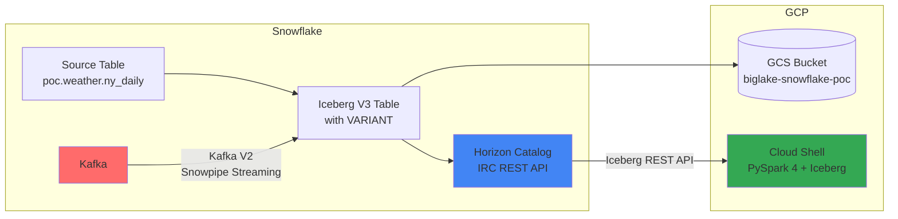

# POC Plan: Horizon-Managed Iceberg for VertexAI

## Overview
This POC demonstrates how to share Snowflake data with VertexAI through Snowflake Horizon-managed Iceberg tables stored on GCS, using the Iceberg REST Catalog (IRC) API.

**Key Features:**
- **Iceberg V3** format with native **VARIANT** column support
- **Kafka Connector V2** (PuPr) with Snowpipe Streaming for real-time VARIANT ingestion
- **PySpark 4.x** with Iceberg Runtime 1.10.1 for external VARIANT reads
- PyIceberg does NOT support VARIANT yet - use PySpark instead

## Architecture

## Implementation Steps

### Step 1: Snowflake Setup
1. Create POC role with necessary privileges
2. Create storage integration for GCS
3. Create external volume pointing to GCS bucket
4. Verify external volume connectivity

### Step 2: GCP Setup (Console Operations)
1. Verify/create service account
2. Grant GCS permissions to Snowflake's service account:
   - storage.buckets.get
   - storage.objects.create/delete/get/list
3. Whitelist Cloud Shell IP in network policy (if applicable)

### Step 3: Iceberg Table Creation
1. Create database and schema for Iceberg tables
2. Create Snowflake-managed **Iceberg V3** table from source
   - Use `ICEBERG_VERSION = 3`
   - Add `weather_summary VARIANT` column
3. Verify data in Iceberg format on GCS
4. Test VARIANT column access in Snowflake

### Step 4: PySpark 4 Read from GCP Cloud Shell
1. Generate programmatic access token (PAT) for IRC authentication
2. Install PySpark 4.x with Iceberg Runtime 1.10.1
3. Configure Spark with Horizon REST catalog
4. Read Iceberg V3 table with **VARIANT column**
5. Access VARIANT fields using Spark SQL (e.g., `weather_summary.temp`)
6. Record performance metrics

**Note:** PyIceberg does NOT support Iceberg V3 VARIANT type. Use PySpark 4.

### Step 5: Kafka Streaming (Optional)
1. Create Iceberg V3 table with VARIANT column
2. Configure Kafka Connector V2 (PuPr) with Snowpipe Streaming
3. Stream data with VARIANT into Iceberg table
4. Verify real-time ingestion

### Step 6: Performance Report
1. Compile metrics (latency, throughput)
2. Document findings

## Environment Configuration

| Component | Value |
|-----------|-------|
| GCP Project | snowflake-corp-pse-poc |
| GCS Bucket | gs://biglake-snowflake-poc |
| GCS Region | us-central1 |
| Snowflake Account | QN43380 |
| External Volume | biglake_gcs_volume |
| Source Table | poc.weather.ny_daily |
| Iceberg Format | V3 (VARIANT support) |
| External Reader | PySpark 4.x + Iceberg Runtime 1.10.1 |
| Kafka Connector | V2 (PuPr) with Snowpipe Streaming |

## Technology Choices

| Requirement | Solution | Why |
|-------------|----------|-----|
| Semi-structured data | VARIANT | Native Snowflake type, flexible schema |
| Iceberg format | V3 | Required for VARIANT support |
| External reader | PySpark 4 | Supports Iceberg V3 VARIANT (PyIceberg does not) |
| Streaming ingest | Kafka Connector V2 | PuPr feature supporting VARIANT to Iceberg |

## Success Criteria
- [ ] External volume created and accessible
- [ ] Iceberg V3 table created with VARIANT column
- [ ] VARIANT column accessible from Snowflake
- [ ] PySpark 4 can read VARIANT column via Horizon IRC
- [ ] Kafka V2 can stream VARIANT data to Iceberg (optional)
- [ ] Performance metrics documented
