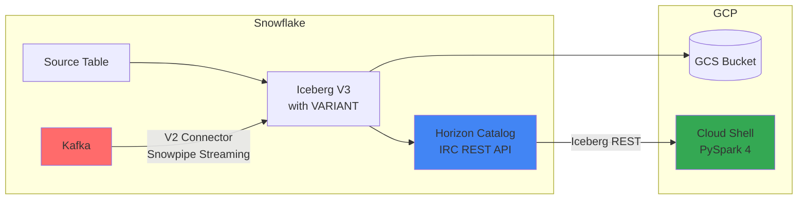

# Quickstart: Horizon-Managed Iceberg with VARIANT for External Readers

Share Snowflake data with external services (GCP, VertexAI) through Snowflake Horizon-managed Iceberg V3 tables with native VARIANT support.

## Overview

This guide demonstrates how to:
- Create Snowflake-managed Iceberg V3 tables with **VARIANT** columns on GCS
- Read Iceberg data from GCP Cloud Shell using **PySpark 4** + Iceberg Runtime
- Stream data via **Kafka Connector V2** (PuPr) with VARIANT support

**Key Technologies:**

| Component | Technology | Notes |
|-----------|------------|-------|
| Semi-structured data | **VARIANT** | Flexible schema, native Snowflake type |
| Iceberg format | **V3** | Required for VARIANT support |
| External reader | **PySpark 4.1.1** + Iceberg 1.10.1 | Supports Iceberg V3 VARIANT |
| Streaming | **Kafka Connector V2** (PuPr) | VARIANT support for Iceberg |

> **Fallback:** If VARIANT doesn't work with external readers, use **structured OBJECT** or **STRING (JSON)**. See fallback options in each section.

## Architecture



## Prerequisites

- Snowflake account with ACCOUNTADMIN access
- GCP project with GCS bucket
- GCP Cloud Shell access
- (Optional) Kafka cluster with Kafka Connect for streaming

## Environment Configuration

| Component | Value |
|-----------|-------|
| GCP Project | `snowflake-corp-pse-poc` |
| GCS Bucket | `gs://biglake-snowflake-poc` |
| Snowflake Account | `QN43380` |
| External Volume | `biglake_gcs_volume` |
| Source Table | `poc.weather.ny_daily` |
| Iceberg Version | **V3** (VARIANT support) |
| External Reader | **PySpark 4.1.1** + Iceberg Runtime 1.10.1 |

---

## Part 1: Snowflake Setup

### 1.1 Configuration Variables

```sql
SET var_role = 'POC';
SET var_warehouse = 'COMPUTE_WH';
SET var_gcs_bucket = 'gcs://biglake-snowflake-poc/';
SET var_gcs_iceberg_path = 'gcs://biglake-snowflake-poc/iceberg/';
SET var_storage_integration = 'horizon_iceberg_gcs_int';
SET var_external_volume = 'biglake_gcs_volume';
SET var_location_name = 'gcs-us-central1';
```

### 1.2 Grant Privileges

```sql
USE ROLE ACCOUNTADMIN;

GRANT CREATE DATABASE ON ACCOUNT TO ROLE IDENTIFIER($var_role);
GRANT CREATE INTEGRATION ON ACCOUNT TO ROLE IDENTIFIER($var_role);
GRANT CREATE EXTERNAL VOLUME ON ACCOUNT TO ROLE IDENTIFIER($var_role);
GRANT USAGE ON WAREHOUSE IDENTIFIER($var_warehouse) TO ROLE IDENTIFIER($var_role);
```

### 1.3 Create Storage Integration

```sql
USE ROLE IDENTIFIER($var_role);

CREATE OR REPLACE STORAGE INTEGRATION IDENTIFIER($var_storage_integration)
  TYPE = EXTERNAL_STAGE
  STORAGE_PROVIDER = 'GCS'
  ENABLED = TRUE
  STORAGE_ALLOWED_LOCATIONS = ($var_gcs_bucket);
```

### 1.4 Get Snowflake GCS Service Account

```sql
DESCRIBE INTEGRATION IDENTIFIER($var_storage_integration);
```

**Copy the `STORAGE_GCP_SERVICE_ACCOUNT` value** for GCP IAM setup.

### 1.5 Create External Volume

```sql
CREATE OR REPLACE EXTERNAL VOLUME IDENTIFIER($var_external_volume)
  STORAGE_LOCATIONS = (
    (
      NAME = $var_location_name
      STORAGE_PROVIDER = 'GCS'
      STORAGE_BASE_URL = $var_gcs_iceberg_path
    )
  );

DESCRIBE EXTERNAL VOLUME IDENTIFIER($var_external_volume);
```

---

## Part 2: GCP Setup

### 2.1 Grant GCS Access

In GCP Console or gcloud CLI:

```bash
gcloud projects add-iam-policy-binding snowflake-corp-pse-poc \
  --member="serviceAccount:<STORAGE_GCP_SERVICE_ACCOUNT>" \
  --role="roles/storage.objectAdmin"
```

### 2.2 Whitelist Cloud Shell IP (if needed)

```sql
-- Find Cloud Shell IP: curl ifconfig.me
ALTER NETWORK POLICY <POLICY_NAME>
SET ALLOWED_IP_LIST = ('<existing_ips>', '<cloud_shell_ip>');
```

---

## Part 3: Create Iceberg V3 Table with VARIANT

### 3.1 Configuration

```sql
SET var_role = 'POC';
SET var_warehouse = 'COMPUTE_WH';
SET var_external_volume = 'biglake_gcs_volume';
SET var_source_table = 'poc.weather.ny_daily';
SET var_iceberg_database = 'ICEBERG_POC';
SET var_iceberg_schema = 'WEATHER';
SET var_iceberg_table = 'NY_DAILY_ICEBERG';
SET var_iceberg_base_location = 'weather/ny_daily/';
SET var_iceberg_full_table = $var_iceberg_database || '.' || $var_iceberg_schema || '.' || $var_iceberg_table;
```

### 3.2 Setup Context

```sql
USE ROLE IDENTIFIER($var_role);
USE WAREHOUSE IDENTIFIER($var_warehouse);

CREATE DATABASE IF NOT EXISTS IDENTIFIER($var_iceberg_database);
CREATE SCHEMA IF NOT EXISTS IDENTIFIER($var_iceberg_database || '.' || $var_iceberg_schema);
USE DATABASE IDENTIFIER($var_iceberg_database);
USE SCHEMA IDENTIFIER($var_iceberg_schema);
```

### 3.3 Create Iceberg V3 Table

> **VARIANT vs Fallbacks:** Use VARIANT for flexible schema. If VARIANT doesn't work with external reader, uncomment the fallback option.

```sql
CREATE OR REPLACE ICEBERG TABLE IDENTIFIER($var_iceberg_full_table)
  CATALOG = 'SNOWFLAKE'
  EXTERNAL_VOLUME = $var_external_volume
  BASE_LOCATION = $var_iceberg_base_location
  ICEBERG_VERSION = 3
  AS SELECT 
    POSTAL_CODE,
    COUNTRY,
    DATE_VALID_STD,
    AVG_TEMPERATURE_AIR_2M_F,
    AVG_HUMIDITY_RELATIVE_2M_PCT,
    AVG_WIND_SPEED_10M_MPH,
    TOT_PRECIPITATION_IN,
    TOT_SNOWFALL_IN,
    AVG_CLOUD_COVER_TOT_PCT,
    
    -- OPTION 1: VARIANT (preferred - flexible schema)
    OBJECT_CONSTRUCT(
      'temp', AVG_TEMPERATURE_AIR_2M_F,
      'wind', AVG_WIND_SPEED_10M_MPH,
      'precip', TOT_PRECIPITATION_IN,
      'humidity', AVG_HUMIDITY_RELATIVE_2M_PCT
    )::VARIANT AS weather_summary
    
    -- OPTION 2: STRING (fallback - if VARIANT fails with external reader)
    -- TO_JSON(OBJECT_CONSTRUCT(
    --   'temp', AVG_TEMPERATURE_AIR_2M_F,
    --   'wind', AVG_WIND_SPEED_10M_MPH,
    --   'precip', TOT_PRECIPITATION_IN,
    --   'humidity', AVG_HUMIDITY_RELATIVE_2M_PCT
    -- )) AS weather_summary
    
  FROM IDENTIFIER($var_source_table);
```

> **Note:** If using STRING fallback, parse with `json.loads()` in Python.

### 3.4 Verify Table

```sql
-- Check schema shows VARIANT (or STRING if using fallback)
DESCRIBE TABLE IDENTIFIER($var_iceberg_full_table);

-- Access fields (VARIANT uses colon notation)
SELECT 
    DATE_VALID_STD,
    weather_summary,
    weather_summary:temp::FLOAT AS temp,      -- VARIANT syntax
    -- JSON_EXTRACT_PATH_TEXT(weather_summary, 'temp')::FLOAT AS temp,  -- STRING fallback
    weather_summary:wind::FLOAT AS wind
FROM IDENTIFIER($var_iceberg_full_table) 
LIMIT 5;
```

---

## Part 4: Generate PAT Token

1. In Snowsight, click **User Menu** (bottom-left)
2. Select **Preferences** → **Programmatic Access Tokens**
3. Click **+ Add Token**
4. Configure: Name=`horizon-iceberg-poc`, Role=`POC`
5. **Copy the token immediately**

---

## Part 5: Read from GCP Cloud Shell (PySpark 4)

> **Important:** PyIceberg does NOT support Iceberg V3 VARIANT. Use PySpark 4.

### 5.1 Install PySpark

```bash
pip install pyspark==4.1.1 --quiet
python3
```

### 5.2 Configuration (Cell 1)

```python
# Configuration
SNOWFLAKE_ACCOUNT = "sfsenorthamerica-akhosro-gcp"  # Use hyphens
PAT_TOKEN = ""  # <-- PASTE YOUR PAT TOKEN
SNOWFLAKE_ROLE = "POC"

CATALOG_NAME = "snowflake_horizon"
WAREHOUSE = "ICEBERG_POC"
NAMESPACE = "WEATHER"
TABLE = "NY_DAILY_ICEBERG"
FULL_TABLE = f"{CATALOG_NAME}.{NAMESPACE}.{TABLE}"

ICEBERG_RUNTIME = "org.apache.iceberg:iceberg-spark-runtime-4.0_2.13:1.10.1"

# Set to True if using STRING fallback instead of VARIANT
USING_STRING_FALLBACK = False
```

### 5.3 Create SparkSession (Cell 2)

```python
import time
from pyspark.sql import SparkSession

spark = SparkSession.builder \
    .appName("Horizon-Iceberg-VARIANT") \
    .config("spark.jars.packages", ICEBERG_RUNTIME) \
    .config(f"spark.sql.catalog.{CATALOG_NAME}", "org.apache.iceberg.spark.SparkCatalog") \
    .config(f"spark.sql.catalog.{CATALOG_NAME}.type", "rest") \
    .config(f"spark.sql.catalog.{CATALOG_NAME}.uri", f"https://{SNOWFLAKE_ACCOUNT}.snowflakecomputing.com/polaris/api/catalog") \
    .config(f"spark.sql.catalog.{CATALOG_NAME}.credential", PAT_TOKEN) \
    .config(f"spark.sql.catalog.{CATALOG_NAME}.warehouse", WAREHOUSE) \
    .config(f"spark.sql.catalog.{CATALOG_NAME}.scope", f"session:role:{SNOWFLAKE_ROLE}") \
    .config(f"spark.sql.catalog.{CATALOG_NAME}.header.X-Iceberg-Access-Delegation", "vended-credentials") \
    .config("spark.sql.extensions", "org.apache.iceberg.spark.extensions.IcebergSparkSessionExtensions") \
    .getOrCreate()

print(f"Spark version: {spark.version}")
```

### 5.4 Explore Catalog (Cell 3)

```python
spark.sql(f"SHOW NAMESPACES IN {CATALOG_NAME}").show()
spark.sql(f"SHOW TABLES IN {CATALOG_NAME}.{NAMESPACE}").show()
```

### 5.5 Describe Table Schema (Cell 4)

```python
spark.sql(f"DESCRIBE {FULL_TABLE}").show(truncate=False)
```

### 5.6 Read with VARIANT (Cell 5)

```python
start_time = time.time()
df = spark.sql(f"SELECT * FROM {FULL_TABLE} LIMIT 5")
df.show(truncate=False)
print(f"Latency: {(time.time() - start_time) * 1000:.2f} ms")
```

### 5.7 Access VARIANT Fields (Cell 6)

```python
# VARIANT access (dot notation in Spark SQL)
if not USING_STRING_FALLBACK:
    spark.sql(f"""
        SELECT 
            DATE_VALID_STD,
            weather_summary.temp AS temp,
            weather_summary.wind AS wind,
            weather_summary.precip AS precip
        FROM {FULL_TABLE}
        LIMIT 10
    """).show()
else:
    # STRING fallback - parse JSON in Python
    import json
    df = spark.sql(f"SELECT DATE_VALID_STD, weather_summary FROM {FULL_TABLE} LIMIT 10")
    for row in df.collect():
        data = json.loads(row['weather_summary'])
        print(f"{row['DATE_VALID_STD']}: temp={data.get('temp')}, wind={data.get('wind')}")
```

### 5.8 Full Table Read (Cell 7)

```python
start_time = time.time()
df_full = spark.sql(f"SELECT * FROM {FULL_TABLE}")
row_count = df_full.count()
latency_ms = (time.time() - start_time) * 1000

print(f"Rows: {row_count}")
print(f"Latency: {latency_ms:.2f} ms")
print(f"Throughput: {row_count / (latency_ms / 1000):.2f} rows/sec")
```

### 5.9 VARIANT Analytics (Cell 8)

```python
# Only works with VARIANT, not STRING fallback
if not USING_STRING_FALLBACK:
    spark.sql(f"""
        SELECT 
            MIN(weather_summary.temp) AS min_temp,
            MAX(weather_summary.temp) AS max_temp,
            AVG(weather_summary.temp) AS avg_temp,
            SUM(weather_summary.precip) AS total_precip
        FROM {FULL_TABLE}
    """).show()
```

---

## Part 6: Cleanup (Optional)

```sql
SET var_role = 'POC';
SET var_iceberg_database = 'ICEBERG_POC';
SET var_iceberg_schema = 'WEATHER';
SET var_iceberg_table = 'NY_DAILY_ICEBERG';
SET var_external_volume = 'biglake_gcs_volume';
SET var_storage_integration = 'horizon_iceberg_gcs_int';
SET var_iceberg_full_table = $var_iceberg_database || '.' || $var_iceberg_schema || '.' || $var_iceberg_table;

USE ROLE IDENTIFIER($var_role);

-- Uncomment to execute:
-- DROP TABLE IF EXISTS IDENTIFIER($var_iceberg_full_table);
-- DROP SCHEMA IF EXISTS IDENTIFIER($var_iceberg_database || '.' || $var_iceberg_schema);
-- DROP DATABASE IF EXISTS IDENTIFIER($var_iceberg_database);
```

---

## Part 7: Kafka Streaming (Optional)

Stream data from Kafka to Snowflake-managed Iceberg V3 with VARIANT columns using Kafka Connector V2 (PuPr).

### 7.1 Configuration

```sql
SET var_database = 'ICEBERG_POC';
SET var_schema = 'STREAMING';
SET var_table = 'KAFKA_EVENTS';
SET var_full_table = $var_database || '.' || $var_schema || '.' || $var_table;
SET var_base_location = 'streaming/kafka_events/';

-- Source table (if creating from existing table schema)
SET var_source_table = '';  -- e.g., 'poc.schema.existing_table' (leave empty if not using)
```

### 7.2 Create Streaming Table

> **VARIANT vs Fallbacks:** Kafka Connector V2 (PuPr) supports VARIANT. If issues arise, use STRING fallback.

```sql
CREATE DATABASE IF NOT EXISTS IDENTIFIER($var_database);
CREATE SCHEMA IF NOT EXISTS IDENTIFIER($var_database || '.' || $var_schema);

-- ----------------------------------------
-- OPTION A: Create from existing table schema
-- Uncomment this block if you have an existing table to base schema on
-- ----------------------------------------
/*
CREATE OR REPLACE ICEBERG TABLE IDENTIFIER($var_full_table)
  CATALOG = 'SNOWFLAKE'
  EXTERNAL_VOLUME = 'biglake_gcs_volume'
  BASE_LOCATION = $var_base_location
  ICEBERG_VERSION = 3
  AS SELECT 
    *,
    -- Add VARIANT columns for Kafka data
    OBJECT_CONSTRUCT()::VARIANT AS payload,
    OBJECT_CONSTRUCT()::VARIANT AS attributes,
    -- Kafka tracking columns
    0::NUMBER AS kafka_offset,
    0::NUMBER AS kafka_partition,
    CURRENT_TIMESTAMP()::TIMESTAMP_LTZ AS ingested_at
  FROM IDENTIFIER($var_source_table)
  WHERE 1=0;  -- Empty table, copies schema only
*/

-- ----------------------------------------
-- OPTION B: Create with manual schema (generic example)
-- ----------------------------------------
CREATE OR REPLACE ICEBERG TABLE IDENTIFIER($var_full_table)
  CATALOG = 'SNOWFLAKE'
  EXTERNAL_VOLUME = 'biglake_gcs_volume'
  BASE_LOCATION = $var_base_location
  ICEBERG_VERSION = 3
  AS SELECT
    'init'::VARCHAR AS event_id,
    CURRENT_TIMESTAMP()::TIMESTAMP_NTZ AS event_timestamp,
    
    -- OPTION 1: VARIANT columns (preferred)
    OBJECT_CONSTRUCT('key', 'value')::VARIANT AS payload,
    OBJECT_CONSTRUCT('source', 'kafka')::VARIANT AS attributes,
    
    -- OPTION 2: STRING fallback (if VARIANT fails)
    -- '{"key": "value"}'::STRING AS payload,
    -- '{"source": "kafka"}'::STRING AS attributes,
    
    0::NUMBER AS kafka_offset,
    0::NUMBER AS kafka_partition,
    CURRENT_TIMESTAMP()::TIMESTAMP_LTZ AS ingested_at
  WHERE 1=0;
```

### 7.3 Kafka Connector V2 Configuration

Save as `snowflake-kafka-iceberg.properties` and deploy to your Kafka Connect cluster:

```properties
name=snowflake-iceberg-sink
connector.class=com.snowflake.kafka.connector.SnowflakeSinkConnector
tasks.max=1

# Kafka
topics=your_topic
kafka.bootstrap.servers=your-kafka-broker:9092

# Snowflake Connection
snowflake.url.name=sfsenorthamerica-akhosro-gcp.snowflakecomputing.com
snowflake.user.name=KAFKA_SERVICE_USER
snowflake.private.key=<BASE64_KEY>
snowflake.role.name=POC
snowflake.database.name=ICEBERG_POC
snowflake.schema.name=STREAMING

# V2 Settings (REQUIRED for VARIANT + Iceberg)
snowflake.ingestion.method=SNOWPIPE_STREAMING
snowflake.streaming.iceberg.enabled=true
snowflake.enable.schematization=true

# Topic to Table
snowflake.topic2table.map=your_topic:KAFKA_EVENTS

# Data Format
value.converter=org.apache.kafka.connect.json.JsonConverter
value.converter.schemas.enable=false

# Performance
buffer.flush.time=30
```

### 7.4 Verify Kafka Data

```sql
-- Check data landed
SELECT * FROM IDENTIFIER($var_full_table) LIMIT 10;

-- Access VARIANT fields
SELECT 
    event_id,
    payload:user_id::STRING AS user_id,    -- VARIANT syntax
    -- JSON_EXTRACT_PATH_TEXT(payload, 'user_id') AS user_id,  -- STRING fallback
    attributes:source::STRING AS source
FROM IDENTIFIER($var_full_table);
```

---

## Troubleshooting

| Error | Cause | Solution |
|-------|-------|----------|
| `IP not allowed` | Network policy | Whitelist Cloud Shell IP |
| `Unsupported field type: 'variant'` | Using PyIceberg | Use PySpark 4 instead |
| `module not found: iceberg-spark-runtime` | Wrong version | Use `1.10.1` for Spark 4.0 |
| `Using existing Spark session` | Stale session | `spark.stop()` and restart Python |
| VARIANT not readable externally | External reader limitation | Use STRING fallback |

---

## Fallback Options Summary

If VARIANT doesn't work with external readers:

| Where | VARIANT | STRING Fallback |
|-------|---------|-----------------|
| Table creation | `::VARIANT` | `TO_JSON(...)` returns STRING |
| Snowflake query | `col:field::TYPE` | `JSON_EXTRACT_PATH_TEXT(col, 'field')` |
| PySpark query | `col.field` | Read as string, parse with `json.loads()` |
| Kafka Connector | Works with V2 | Store as STRING, parse in reader |

---

## Success Checklist

- [ ] Storage integration created
- [ ] External volume created  
- [ ] GCS permissions granted to Snowflake service account
- [ ] Iceberg V3 table created (VARIANT or STRING fallback)
- [ ] Data accessible in Snowflake
- [ ] PAT token generated
- [ ] Cloud Shell IP whitelisted (if applicable)
- [ ] PySpark 4 + Iceberg Runtime 1.10.1 loads successfully
- [ ] Spark connects to Horizon catalog
- [ ] Data readable via PySpark (VARIANT or STRING)
- [ ] (Optional) Kafka streams to Iceberg table
