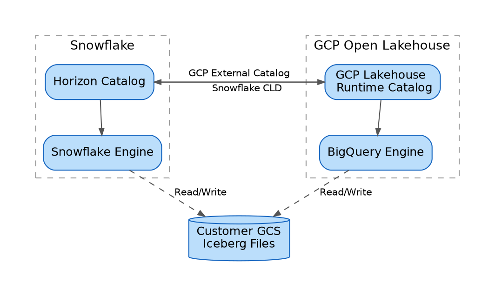
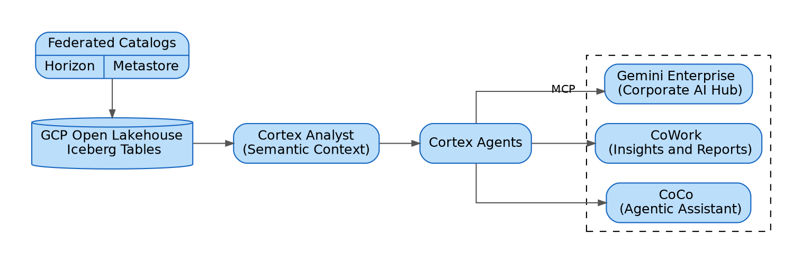
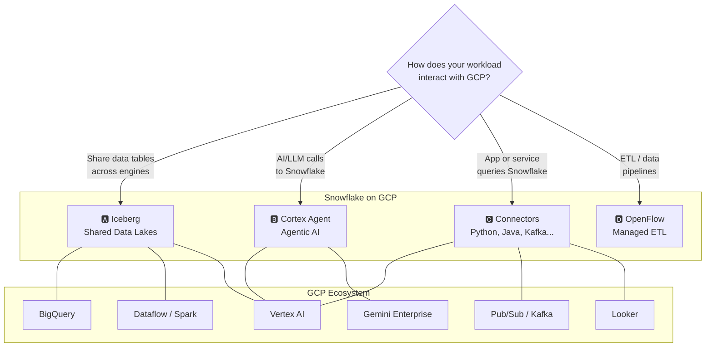

# GCP + Snowflake: Better Together

- **Audience:** Executives and Managers (Partnership, Sales, Engineering, Marketing)
- **Structure:** Organized around our **three sales motions** — Migration, Open Lakehouse (Iceberg), and AI & Gemini
- **Last Updated:** September 2026
- **Contact:**
    - sasha.wright-neville@snowflake.com (Partnership)
    - britny.holloway@snowflake.com (Sales)
    - ali.khosro@snowflake.com (Engineering)
    - heidi.newland@snowflake.com (Marketing)

> **Provenance and confidence.** This doc consolidates `snowflake-on-gcp-primer.md` (April 2026) and the AI-Ready Iceberg blog post. Anything marked ⚠️ is **projected or written from general knowledge and is not independently verified** — confirm against the [Feature Parity Tracker](https://docs.google.com/spreadsheets/d/1p22ahwnb3h1NEaCG77tYMuVN0Ob59eY9cqZMUe2gOQQ/edit?usp=sharing) before external use. The **Migration** section in particular has no source material in this repo and needs review.

## Executive Summary

The Snowflake–Google Cloud story has moved from *"Snowflake also runs on GCP"* to *"GCP is a differentiated home for Snowflake."* We land that story through three distinct motions:

| # | Motion | The Pitch | Primary Competitor / Alternative |
|---|---|---|---|
| **1** | **Migration** | Move legacy and on-prem warehouses to Snowflake on GCP; consumption draws down the customer's Google commitment | Teradata, Oracle, Netezza, BigQuery |
| **2** | **Open Lakehouse (Iceberg)** | One copy of data in the customer's GCS, many engines, unified governance — coexistence rather than displacement | BigQuery-only lakehouse, self-managed Polaris |
| **3** | **AI & Gemini** | Gemini is the *default* LLM for Snowflake AI on GCP; Cortex grounds it in semantic models so answers are accurate | Generic LLM-over-warehouse, Vertex-only stacks |

**Why the combination works.** Motion 2 lowers the barrier to entry in Google-native accounts (no rip-and-replace required), Motion 1 converts legacy spend into GCP-committed consumption, and Motion 3 is the differentiator no other cloud can match — Snowflake's AI stack pre-wired to that cloud's frontier model.

**Commercially**, the co-sell motion is the quiet accelerant: Snowflake purchased through GCP Marketplace draws down MACC commitments, and Google sellers receive 50% quota attainment. Snowflake on GCP is additive to a Google relationship, not a competing line item.

**The honest gap:** newest Snowflake features still land on GCP 1–3 quarters after AWS, in-region Cortex has not yet landed, and FedRAMP on GCP remains TBD. Those are the recurring objections; the roadmap below is how we answer them.

## Motion 1 — Migration

**The pitch:** consolidate legacy and on-prem data warehouses onto Snowflake running on Google Cloud. The customer modernizes the platform *and* draws the spend against an existing Google commitment.

### Source Platforms

| Source | Typical Driver | Notes |
|---|---|---|
| **Teradata / Netezza / Exadata** | End-of-life hardware, punitive license renewals | Highest-value migrations; strongest ROI story |
| **Oracle / SQL Server DW** | Cost, scaling limits, cloud mandate | Often paired with an app-modernization program |
| **Hadoop / Cloudera** | Operational burden, talent scarcity | Natural bridge to the Iceberg motion (Motion 2) |
| **BigQuery** | Workload isolation, governance, multi-cloud portability | ⚠️ Sensitive — position as *coexistence first* (see below) |

### Tooling and Approach

- **SnowConvert** — automated code conversion for DDL, SQL, stored procedures, and ETL logic, with a conversion report that quantifies effort and flags unsupported objects before committing to a plan.
- **Phased migration** — land raw data, convert transformations, migrate consumption (BI/reporting) last, so the legacy system can run in parallel during validation.
- **Data validation** — row/column-level reconciliation between source and target is the step that determines whether a migration is trusted; budget for it explicitly.

### The BigQuery Nuance — Read This Before Pitching

Do **not** lead with BigQuery displacement in a Google-native account. It puts the Google account team on the defensive and undercuts the co-sell motion that makes GCP our best-aligned hyperscaler.

Lead with **Motion 2 (Iceberg coexistence)** instead: both engines read the same tables in the customer's GCS, each team keeps its preferred tool, and Snowflake earns workloads on governance and isolation rather than by taking them away. Displacement, where it happens, is an *outcome* of that coexistence — not the opening argument.

### Commercial Levers

- **MACC drawdown** — Snowflake bought through GCP Marketplace counts against Google committed spend, so migration consumption consumes budget the customer has already committed.
- **Migration credits** — POC credits and migration assistance are available for workloads moving from BigQuery, on-prem (Teradata, Oracle, Netezza), or other cloud data platforms.
- **Joint incentive programs** — Google and Snowflake periodically fund POCs and offer additional credits for strategic AI/ML and lakehouse-modernization workloads.

## Motion 2 — Open Lakehouse (Iceberg)

**The pitch:** one copy of data in the customer's own GCS bucket, read and written by every engine they already run — Snowflake, BigQuery, Spark/Dataproc, Dataflow, Vertex AI — with a single governance layer over all of it. No ETL between engines, no vendor lock-in.

This is our **most effective land motion on GCP** because it reframes the conversation from displacement to coexistence.

### Why Iceberg, in One Paragraph

Every engine used to own its data, which worked when an organization had one analytics engine. They no longer do. The alternative to copying data into each engine is the **data locality** principle: move compute to the data, not data to the compute. That requires all engines to agree on a physical layout — and the industry converged on **Apache Iceberg** as that shared language. **No copies. No ETL. One source of truth. Many engines.**

### The Catalog Is the Governance Layer

Once multiple engines can write the same files, something must own metadata, enforce access policy, and coordinate concurrent writers. That is the **catalog**. Without it, open data is *ungoverned* data.

Catalogs also control storage access through **vended credentials** — short-lived, narrowly scoped tokens issued per request instead of standing bucket credentials. No engine holds persistent access to storage.

The **Iceberg REST Catalog (IRC)** is the open API that lets any engine talk to any catalog, so implementations can be swapped without changing client code. On GCP there are two managed options:

- **GCP Lakehouse runtime catalog** — Google-managed; tables and metadata in customer GCS, native BigQuery integration. Fits when BigQuery is the primary query surface.
- **Snowflake Horizon Catalog** — integrates Apache Polaris (donated by Snowflake to the ASF) and exposes a standards-compliant IRC endpoint in every Snowflake account with no setup. Layers on RBAC, column masking, row access policies, lineage, and audit. Fits when governance must extend across all connected services.

Customers can also self-manage **Apache Polaris** for full control — at the cost of full operational responsibility.

## Bidirectional — With Honest Gaps

Federation runs **both directions**. Reads are mature in both; **cross-engine writes are the newer capability and not uniformly GA.** Be precise about this in customer conversations — over-claiming write parity is how POCs fail.

| Direction | Catalog Owner | Operation | Mechanism | Status |
|---|---|---|---|---|
| Snowflake → its own tables | Horizon | Read + Write | Native | ✅ GA |
| **GCP engines → Snowflake-managed tables** | Horizon | **Read** | Horizon IRC endpoint | ⚠️ Expected GA — verify |
| **GCP engines → Snowflake-managed tables** | Horizon | **Write** | Horizon IRC endpoint | ⚠️ **Newer — assume preview/limited until verified** |
| **Snowflake → GCP-managed tables** | GCP Lakehouse runtime | **Read** | Catalog-Linked Database (CLD) | ⚠️ Expected Public Preview |
| **Snowflake → GCP-managed tables** | GCP Lakehouse runtime | **Write** (`INSERT`/`UPDATE`/`DELETE`) | Catalog-Linked Database (CLD) | ⚠️ **Newer — confirm GA status** |
| BigQuery → its own tables | GCP Lakehouse runtime | Read + Write | Native | ✅ GA |

**Safe framing for customers:** *"Reads are bidirectional and production-ready today. Writes work in both directions, but confirm the specific path for your workload — some cross-engine write paths are still preview."*

### Additional Proof Points

- **No Snowflake credentials required** for GCP-side readers — engines read Parquet from GCS directly and resolve metadata through the Horizon IRC REST API. Validated with PySpark 4 / Iceberg Runtime 1.10.1 (`snowflake-managed-iceberg-on-gcp/`).
- **Iceberg V3 supports VARIANT**, so semi-structured JSON/nested data is shared in open format rather than flattened first.
- **Streaming in** — Kafka and Pub/Sub ingest straight into Iceberg, continuously updated.

## Catalog Federation: The Open Lakehouse on GCP

An open table format solves interoperability, but raises a governance question: **who is in charge?** When multiple engines read and write the same files, something must manage metadata, enforce access policy, and coordinate concurrent writers. That is the **catalog** — the governance layer of a lakehouse. Without it, open data is *ungoverned* data.

Catalogs also control storage access through **vended credentials**: short-lived, narrowly scoped tokens issued per request, instead of standing bucket credentials.

**Federation is the recommended pattern — and it runs both ways:**

- **GCP-managed → Snowflake:** a **Catalog-Linked Database (CLD)** auto-discovers and syncs tables from the remote IRC endpoint. Snowflake users run standard SQL as if the tables were native, with Snowflake governance layered on top.
- **Snowflake-managed → GCP:** BigQuery, Dataproc, and other services connect to Horizon's IRC endpoint through the Lakehouse **external catalog connection** and read/write directly.

Reads are production-ready in both directions. ⚠️ **Cross-engine writes are newer — verify the specific path before committing to it in a POC.**

**No data movement. No vendor lock-in. One copy of data, many engines, unified governance.**

## Motion 3 — AI & Gemini

**The pitch:** Gemini is the **default LLM for Snowflake AI on GCP** — Cortex Analyst, Cortex Agents, AISQL, and Snowflake Intelligence all default to Gemini models in GCP regions. No other cloud gets Snowflake's AI stack pre-wired to that cloud's frontier model. That is a genuine home-field advantage.

### Cortex Accuracy Is a Governance Story, Not a Model Story

The competitive argument is *not* "our model is better" — it is that Cortex grounds answers in semantic models, metadata, and query history, which is why it beats generic LLM-over-warehouse approaches on hallucination rate. This is how we answer *"we'll just point Gemini at BigQuery."*

An open lakehouse solves interoperability but does not make data useful to AI. Three gaps sit between "data is accessible" and "AI produces accurate, trusted answers":

1. **Programmatic access.** AI agents need their own channel. Snowflake exposes **MCP servers** (open standard, created by Anthropic, now governed by the Linux Foundation) so Gemini, IDE assistants, and custom frameworks connect through one interface instead of bespoke integrations. **Cortex Agents REST API** covers orchestration frameworks and embedded analytics.
2. **Semantic grounding.** **Semantic models** define metrics, dimensions, relationships, and verified query patterns over physical tables. The principle that matters: **business logic belongs in the data layer, not in AI prompts** — so every AI system inherits the same correct logic, with no drift. **Snowflake Autopilot** makes this scale by discovering and maintaining semantic models automatically from query patterns and usage.
3. **Contextual intelligence.** **Cortex Context** supplies business-term descriptions, data quality signals (freshness, completeness, caveats), and which tables are authoritative for which questions — across *any* Iceberg table, native or federated.

### Bidirectional Agentic Integration Is Validated

POC in this repo (`gemini-enterprise-calls-cortex/via-REST/`) proves Gemini Enterprise → Vertex AI Agent Engine (ADK) → Cortex Agent REST API. Three findings worth carrying into every deal:

- Gemini Enterprise **Custom Actions were deprecated in March 2026** — Agent Engine + ADK is the supported path. Anyone building on the old pattern is building on a dead integration.
- Two LLM hops (Gemini + Cortex) add **~20s latency** — fine for conversational data Q&A, not for interactive dashboards.
- Agent Engine egress IPs are non-standard (`136.124.x.x`) and **must be whitelisted** in the Snowflake network policy.

### Consumption Surfaces

- **CoWork** (AI data analyst — governed insights and reports)
- **Cortex Code** (agentic IDE for pipelines, agents, and apps)
- **Gemini Enterprise** (corporate AI hub). 

Because the lakehouse runs on GCP, Gemini is native across the stack — multimodal understanding brings GCS documents and images into the workflow, and long context windows ingest full schemas and semantic definitions at once.

## AI-Ready: From Open Lakehouse to Grounded AI

An open lakehouse solves *interoperability*. It does not by itself make data useful to AI. Three gaps sit between "data is accessible" and "AI produces accurate, trusted answers":

**1. Programmatic access.** Human analysts query through their engine of choice; AI agents need their own channel. Snowflake exposes **MCP servers** so Gemini, IDE assistants, and custom agent frameworks all connect through one interface instead of bespoke integrations. **Cortex Agents REST API** covers orchestration frameworks and embedded analytics.

**2. Semantic grounding.** AI hallucinates when it doesn't know what data *represents*. **Semantic models** define metrics, dimensions, relationships, and verified query patterns on top of physical tables. The key principle: **business logic belongs in the data layer, not in AI prompts** — so every AI system inherits the same correct logic, with no drift. **Snowflake Autopilot** makes this scale by discovering and maintaining semantic models automatically, so accuracy doesn't decay as schemas evolve.

**3. Contextual intelligence.** **Cortex Context** supplies business-term descriptions, data quality signals, and which tables are authoritative for which questions — across *any* Iceberg table, native or federated. This is the difference between "revenue might be…" and "Q4 revenue was $47.2M from the authoritative `finance.revenue` table."

**Consumption surfaces:** **CoWork**, **Cortex Code**, and **Gemini Enterprise** — all inheriting the same semantic layer, context, and governance.

> Business logic lives in the data layer. Context travels with the data. Every AI interaction produces grounded, accurate, governed answers.

## Feature Status — GCP

Snowflake is a **cloud-agnostic, fully managed AI Data Cloud**. Core features — warehouses, Iceberg, Cortex AI, Snowpark, SPCS, Streamlit, Notebooks — are available on GCP, and the customer experience is consistent across clouds. This table tracks **GCP-specific** items only.

- **Newest features** (e.g., OpenFlow, Snowflake Postgres) roll out on different schedules — the gap is typically **1–3 quarters**
- Leadership prioritizes **managed OpenFlow** over BYOC, on customer success and reduced complexity
- Snowflake's direction prefers **Snowflake Postgres** over Hybrid Tables for OLTP

| Feature | Priority | Status / ETA | Motion |
|---|---|---|---|
| **Cortex on GCP** (cross-region) | ✅ Done | GA | AI |
| **Gemini in Cortex** (AISQL, Analyst, SI) | ✅ Done | GA | AI |
| **Iceberg: Snowflake Managed Catalog** | ✅ Done | GA | Lakehouse |
| **Iceberg: GCP Open Lakehouse Managed** | ✅ Done | GA | Lakehouse |
| **BigLake: Catalog Federation** | ✅ Done | ⚠️ Public Preview | Lakehouse |
| **Notebooks vNext in Workspaces** | ✅ Done | GA | AI |
| **Expansion (APAC)** | ✅ Done | Launched | All |
| **OpenFlow** (Managed) | ✅ Done | ⚠️ Public Preview | Migration |
| **Cortex on GCP** (in-region) | 🟠 High | ⚠️ Q2 FY27 ETA now past — verify | AI |
| **Snowflake Postgres** | 🟠 High | 🟠 Q3 FY27 — in flight | Migration |
| **FedRAMP on GCP** | 🟡 Medium | TBD — blocks public sector | All |
| **OpenFlow** (BYOC) | 🟡 Medium | 🟡 Q3 FY27 — in flight | Migration |
| **Hybrid Tables** | 🔵 Low | 🔵 Q4 FY27 — deprioritized | — |

## Integration Highways

Snowflake is an integral part of the GCP stack, working natively with Vertex AI, BigLake, BigQuery, Gemini Enterprise, Dataflow, Pub/Sub, and Looker. There are **five highways** for Snowflake ↔ GCP communication:

| # | Highway | Use When | Motion |
|---|---|---|---|
| **A** | **Iceberg** — shared data lakes on GCS | Sharing data tables across engines | Lakehouse |
| **B** | **Cortex Agent** — agentic AI | AI/LLM calls into Snowflake data | AI |
| **C** | **Connectors** — Python, Java, Kafka, JDBC | An app or service queries Snowflake (~25% of Snowflake consumption) | All |
| **D** | **OpenFlow** — managed ETL on Apache NiFi | ETL and data pipelines; 50+ connectors incl. BigQuery, GCS, Pub/Sub, Drive, Sheets, Ads | Migration |
| **E** | **Sharing & Replication** — zero-copy | Cross-account, cross-cloud sharing; Marketplace, Clean Rooms | All |

## Partnership and Commercial Incentives

### Strategic Alliance

Snowflake and Google Cloud have been strategic partners since 2018, when Snowflake launched natively on GCP. In 2024 the two companies announced a multi-year expanded partnership focused on joint AI/ML innovation, GTM alignment, and deep product integration. Snowflake runs natively on Google Cloud infrastructure across multiple regions, using GCS for storage, GCE for compute, and Google's global network for cross-region replication.

Google Cloud is the **fastest-growing hyperscaler** — 48% YoY revenue growth, $17.7B quarterly revenue, and a $240B backlog. ⚠️ *These figures are from the April 2026 primer and are now stale — refresh before external use.*

### Co-Sell and Go-to-Market

The two companies operate a robust **co-sell motion** through Google Cloud Marketplace. Customers purchase Snowflake credits directly through GCP Marketplace, which means Snowflake consumption **counts toward Google Cloud committed spend (MACC)**. This is the major procurement incentive: organizations with existing GCP enterprise agreements draw down committed cloud spend by running Snowflake, with no separate contract or budget line.

### Financial Incentives

| Lever | What It Does |
|---|---|
| **MACC drawdown** | Snowflake via GCP Marketplace counts against Google committed spend |
| **Migration credits** | POC credits and migration assistance from BigQuery, on-prem (Teradata, Oracle, Netezza), or other cloud platforms |
| **Joint incentive programs** | Periodic joint credits, discounted rates, and funded POCs — especially AI/ML and lakehouse modernization |
| **ISV and partner programs** | Joint funding for solution development, marketplace listing, co-marketing |
| **Google seller alignment** | Marketplace transactions count **50% toward Google seller quota attainment** |

### Why It Matters

Choosing Snowflake on GCP is not "either/or" — it is additive. Customers get Snowflake's workload isolation, governance, and cross-cloud portability alongside GCP's AI/ML ecosystem, networking, and pricing. The co-sell alignment means the Google account team is **motivated to help make Snowflake successful**, and the Marketplace path removes procurement friction.

## Snowflake Core Offerings

| Capability | Use Case |
|---|---|
| **🛡️ Data Admin (Horizon)** | |
| RBAC, masking, Trust Center | Define who accesses what, mask sensitive columns, monitor compliance posture |
| Transactional and analytical | OLTP and OLAP workloads in one platform |
| Structured / semi / unstructured | Govern tables, JSON, Parquet, PDFs, images under one policy |
| Sharing and replication | Share governed data with partners; replicate across regions and clouds |
| Autoscaling Gen2 warehouses | Compute scales automatically — no manual tuning |
| **🔧 Data Engineering** | |
| OpenFlow | Ingest streaming data from Kafka, GCS, or Pub/Sub |
| Dynamic Tables | Declarative transformations, refreshed on schedule |
| Interactive Tables | Sub-second queries for real-time dashboards |
| dbt | Model, test, document transformations in version-controlled SQL |
| **🧪 Data Science / ML** | |
| Notebooks vNext | Mixed SQL/Python interactive development |
| Feature Store | Version and serve ML features consistently |
| Model Registry | Register models with metadata, versioning, lineage |
| ML Container Runtime | Distributed training with Ray or PyTorch on GPU/CPU pools |
| **📱 Developer** | |
| Cortex Code | AI-assisted coding, debugging, generation |
| Workspaces | Git-backed IDE with branching and CI/CD |
| Snowflake Postgres | Postgres wire-compatible transactional apps |
| Native Connectors | Python, Go, Java, Kafka, Spark |
| SP Container Services | Run Docker containers, APIs, microservices |
| Marketplace | Publish or consume data products and apps |
| **📊 Analyst** | |
| Snowflake Intelligence | Natural-language questions over governed data |
| Snowsight | SQL, charts, dashboards |
| Streamlit | Interactive data apps without frontend code |
| **🤖 Cortex AI** | |
| Cortex Functions | Summarize, classify, extract, translate |
| Cortex Search | Hybrid vector + keyword search |
| Cortex Analyst | Natural language → SQL, grounded in semantic models |
| Cortex Agents | Multi-step AI workflows that reason, plan, use tools |
| MCP Client and Server | Integrate external tools via Model Context Protocol |
| Cortex REST APIs | Access Cortex from external applications |

### Why Snowflake on GCP

| Pillar | What It Means |
|---|---|
| **Easy** | Fully managed, near-zero maintenance, instant elasticity, SQL and Python |
| **Integrated** | Breaks silos across clouds and ecosystems; native GCP service integration |
| **Trusted** | Built-in security, governance, business continuity |
| **Complete** | Zero data movement, zero ETL — all workloads (AI, ML, DE, BI) where data lives |
| **OLTP and OLAP** | Postgres for transactional, Interactive Tables for near-real-time, autoscaling warehouses for analytical |
| **High-Accuracy AI** | Cortex reduces hallucination via metadata, query history, and semantic views |

## What to Watch Next Quarter

| Item | Motion | Why It Matters |
|---|---|---|
| **Cortex in-region GA** | AI | Unblocks data-residency-constrained AI deals; biggest single lever |
| **Cross-engine Iceberg write GA** | Lakehouse | Removes the main caveat in the bidirectional story |
| **BigLake federation → Public Preview** | Lakehouse | Makes the coexistence pitch self-serve rather than PrPr-gated |
| **Snowflake Postgres on GCP** | Migration | Completes OLTP + OLAP in one platform |
| **OpenFlow Managed → Public Preview** | Migration | Removes the ETL objection for GCP-source ingestion |
| **FedRAMP on GCP** | All | Still TBD; gates public sector entirely |

## References

- [Snowflake on GCP Primer](./snowflake-on-gcp-primer.md) — original technical primer
- [Google Next Deck Content](./snowflake-google-next.md) — POC architectures and diagrams
- [AI-Ready Iceberg: The Open Lakehouse Story](../hands-on-lab-cortex-gemini/assets/blog-post.md) — source for federation and AI-stack slides
- [Feature Parity Tracker](https://docs.google.com/spreadsheets/d/1p22ahwnb3h1NEaCG77tYMuVN0Ob59eY9cqZMUe2gOQQ/edit?usp=sharing) — **authoritative source for the status tables**
- [Partnership Page](https://snowflake.seismic.com/Link/Content/DCfWjJDRB9dg9GmPDm2WVFcmd9F3)
- [GCP Dashboard](https://go/gcp-dashboard)
- [Reference Architecture (Slides)](https://docs.google.com/presentation/d/1O5LaL691F9lWdzzl6oTjWvqFIVyry5_NBN0zmjZ6NhU/edit?usp=sharing)
- [GitHub: GCP-Snowflake Solutions](https://github.com/sfc-gh-akhosro/gcp-snowflake-solutions)

**POC repos in this collection:**
- `snowflake-managed-iceberg-on-gcp/` — Horizon Iceberg read from PySpark/Vertex AI via IRC
- `gemini-enterprise-calls-cortex/via-REST/` — Gemini Enterprise → Cortex Agent
- `mcp-connection-gemini-enterprise-snowflake-cortex-quickstart/` — MCP integration
- `hands-on-lab-cortex-gemini/` — end-to-end Iceberg + Cortex + Gemini lab
- `looker-snowflake/` — Looker on Snowflake quickstart
