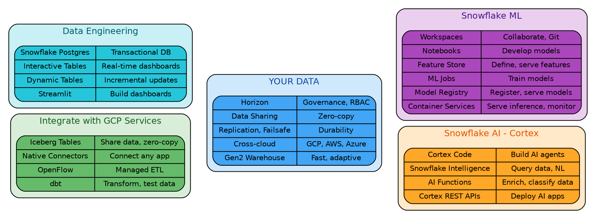
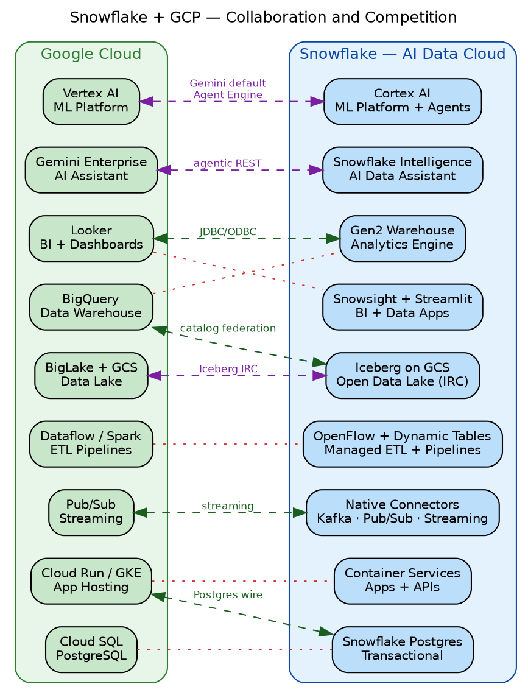
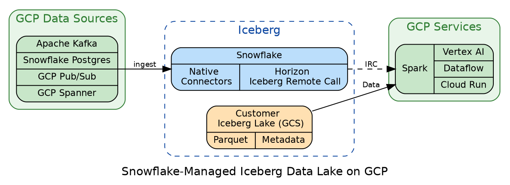
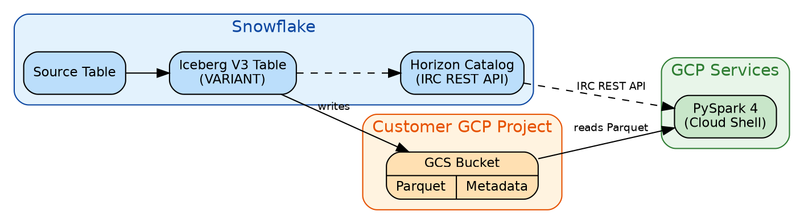
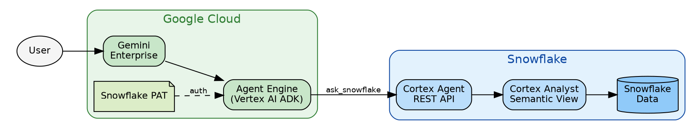
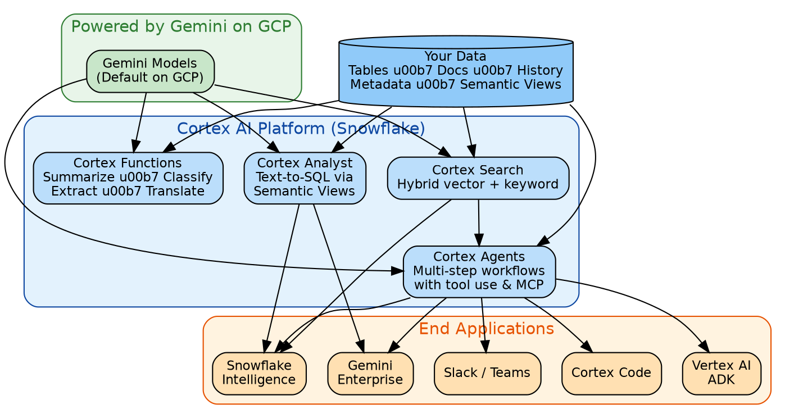
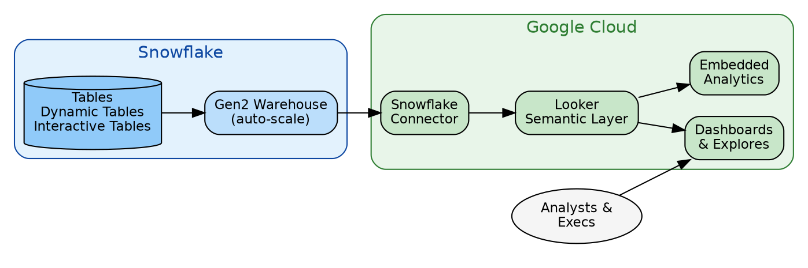
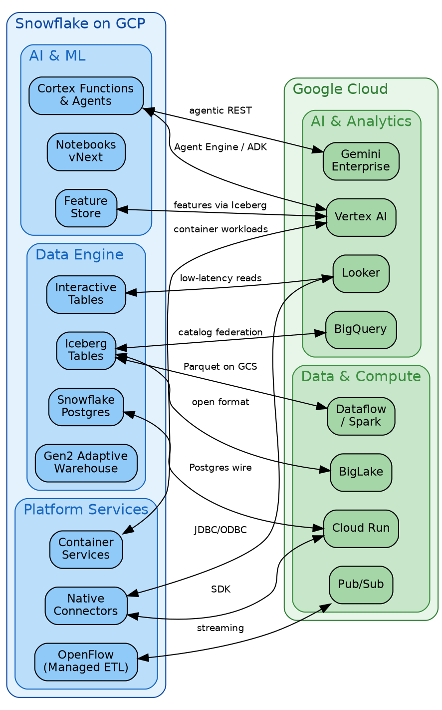

# Snowflake on Google Cloud 

## Snowflake — AI Data Cloud on GCP

**Snowflake is the AI Data Cloud** — a fully managed, cloud-native platform where all data workloads (AI, analytics, data engineering, and transactional apps) run in one place, next to your data. On GCP, Snowflake runs natively on Google Cloud Storage, uses Gemini as the default LLM, and is available through GCP Marketplace (MACC-eligible).

**The central design principle:** your data does not move. In a typical GCP data stack, data flows between BigQuery, Vertex AI, Dataflow, Looker, Cloud SQL, and GCS — each requiring separate IAM, monitoring, billing, and platform engineering. Snowflake collapses this into one fully governed platform: no data copies, no overhaul, no fragmentation. **Workloads come to your data.**

Snowflake is both a **collaborator** and a **competitor** to many GCP services — intentionally. It integrates with Vertex AI, BigQuery, Looker, Pub/Sub, and BigLake through open standards, while offering equivalent capabilities in a unified, fully managed package. GCP customers add Snowflake to unify and govern their existing stack rather than replace it.

> **Edge legend:** purple dashed = integrate + compete · green dashed = integrate only · red dotted = compete only

| Pillar | What It Means for GCP Customers |
|---|---|
| **Easy** | Fully managed — no infra to provision, no clusters to tune, instant elasticity via SQL |
| **Integrated** | Gemini as default LLM · Iceberg for zero-copy data sharing · MACC drawdown via Marketplace |
| **Secure** | Horizon: RBAC, column masking, audit, data clean rooms — single governance across all workloads |
| **Complete** | AI · ML · Analytics · Engineering · OLTP · Apps — all where your data lives, zero data copies |

---

## Iceberg — The Data Integration Layer for GCP

**Iceberg is how Snowflake and GCP share data — no copies, no ETL, one source of truth.**

| Benefit | Detail |
|---|---|
| **Open Format** | Apache Iceberg on GCS — no vendor lock-in, Parquet files readable by any engine |
| **Zero Copy** | Data stays in GCS — no duplication, no ETL between engines |
| **No Credentials** | GCP engines read via Horizon IRC REST API — no Snowflake login needed |
| **Governed** | Horizon manages catalog, access policies, and audit — single control plane |
| **Semi-Structured** | Iceberg V3 supports VARIANT — share JSON/nested data in open format |
| **Real-Time** | Streaming ingestion from Kafka/Pub/Sub → Iceberg, continuously updated |

> Docs: [Iceberg Tables](https://docs.snowflake.com/en/user-guide/tables-iceberg) · [External Volume for GCS](https://docs.snowflake.com/en/user-guide/tables-iceberg-configure-external-volume-gcs) · [IRC REST Catalog](https://docs.snowflake.com/en/user-guide/tables-iceberg-rest-catalog)

## POC — Horizon-Managed Iceberg for Vertex AI

**Share Snowflake data with GCP/Vertex AI through Iceberg V3 tables — no data copies, no credentials**

**POC steps:**
1. Set up Snowflake storage integration and external volume on GCS
2. Create Iceberg V3 table with VARIANT column from source table
3. Read from GCP Cloud Shell using PySpark 4 + Iceberg Runtime 1.10.1
4. No Snowflake credentials needed — PySpark reads GCS directly via Horizon catalog

| Use Case | Example |
|---|---|
| **ML Training** | Vertex AI reads Iceberg features directly from GCS for model training |
| **ETL Interop** | Dataflow/Spark transforms Iceberg data without going through Snowflake |
| **App Serving** | Cloud Run apps query Iceberg for low-latency reads |
| **Cross-Engine Analytics** | BigQuery, Spark, and Snowflake all query the same Iceberg table |
| **Data Mesh** | Teams publish Iceberg tables, consumers pick their preferred engine |

> POC repo: `snowflake-managed-iceberg-on-gcp/` · [Iceberg V3 Docs](https://docs.snowflake.com/en/user-guide/tables-iceberg-v3-specification-support)

## POC — Gemini Enterprise Calls Snowflake Cortex Agent

**Ask a question in Gemini Enterprise → get an answer from Snowflake data — no SQL, no context switching**

*Example: "What was the hottest day in 2021?" → "June 29, 2021, 87.9°F"*

**How it works:**
- Vertex AI Agent Engine agent (Google ADK) has one tool: `ask_snowflake`
- POSTs to Snowflake Cortex Agent `:run` REST API using a PAT
- Cortex Agent uses Cortex Analyst + Semantic View to generate SQL and return answers

**Key findings:**
- GE Custom Actions are deprecated (March 2026) — Agent Engine + ADK is the working path
- Two LLM hops (Gemini + Cortex) add ~20s latency — acceptable for data Q&A
- Agent Engine egress IPs are non-standard (`136.124.x.x`) — must whitelist in Snowflake network policy

> POC repo: `gemini-enterprise-calls-cortex/via-REST/` · [Cortex Agents Docs](https://docs.snowflake.com/en/user-guide/snowflake-cortex/cortex-agents)

## Cortex AI — Snowflake's AI Platform on GCP

**Cortex AI brings LLMs to your data — not your data to LLMs. Gemini is the default model on GCP.**

**Why higher accuracy than generic AI:**
- Cortex sees table metadata, column stats, and query history
- Semantic Views define business logic — Analyst generates SQL grounded in your schema
- Cortex Guard filters unsafe/hallucinated responses
- Data never leaves Snowflake's governance perimeter

> Docs: [Cortex Overview](https://docs.snowflake.com/en/user-guide/snowflake-cortex/overview) · [Cortex Analyst](https://docs.snowflake.com/en/user-guide/snowflake-cortex/cortex-analyst) · [Cortex Search](https://docs.snowflake.com/en/user-guide/snowflake-cortex/cortex-search/cortex-search-overview)

## POC — Looker + Snowflake on GCP

**Looker connects natively to Snowflake — governed BI dashboards over your AI Data Cloud**

**Use cases:**
- Enterprise BI dashboards powered by Snowflake warehouses with Looker's semantic layer
- Interactive Tables for sub-second dashboard queries on operational data
- Dynamic Tables pre-aggregate data — Looker reads without heavy SQL
- Embedded analytics — Looker dashboards in customer-facing apps, backed by Snowflake

**Benefits:**
- Looker's governed semantic layer + Snowflake's governed data = end-to-end trust
- Gen2 Adaptive Warehouses auto-scale for concurrent Looker users — no tuning
- Single source of truth — same data powers Looker, Snowsight, and Streamlit

> POC repo: *(link to Looker POC when available)* · [Snowflake Connectors](https://docs.snowflake.com/en/developer-guide/drivers)

## Snowflake ML — Train and Serve Where Your Data Lives

> You already have the ML architecture diagram — use it here.

**End-to-end ML lifecycle without moving data out of Snowflake.**

| ML Workflow Step | Snowflake Feature | GCP Integration |
|---|---|---|
| **Develop** | Notebooks vNext (SQL + Python) | — |
| **Features** | Feature Store | Vertex AI Feature Store (interop via Iceberg) |
| **Train** | ML Jobs on SPCS (Ray, PyTorch on GPU) | Vertex AI Custom Training (alternative path) |
| **Register** | Model Registry (versioning, lineage) | — |
| **Serve** | Model Registry Inference (batch/real-time) | Vertex AI Endpoints (external deployment) |

**Why ML in Snowflake on GCP:**
- Data stays governed — no copies to external notebooks or training clusters
- GPU/CPU compute pools in SPCS — distributed Ray and PyTorch jobs
- Feature Store serves consistent features for training and inference
- Models registered with lineage tracking — audit-ready

> Docs: [Snowflake ML](https://docs.snowflake.com/en/developer-guide/snowflake-ml/overview) · [Feature Store](https://docs.snowflake.com/en/developer-guide/snowflake-ml/feature-store/overview) · [Model Registry](https://docs.snowflake.com/en/developer-guide/snowflake-ml/model-registry/overview)

## Overall Architecture — Snowflake + GCP Working Together

**A unified workload spanning ML, AI, Dashboards, and OLTP — all on Snowflake + GCP**

**Example workload flow:**

| Workload | Snowflake | GCP |
|---|---|---|
| **Ingest** | OpenFlow pulls from Pub/Sub, GCS, Google Ads | Pub/Sub streams events |
| **Transform** | Dynamic Tables auto-refresh, Gen2 warehouse scales | — |
| **ML** | Notebooks develop, Feature Store serves, SPCS trains on GPU | Vertex AI for additional training/deployment |
| **AI** | Cortex Agents answer questions, Cortex Functions enrich data | Gemini Enterprise for end-user Q&A |
| **Dashboard** | Interactive Tables serve sub-second queries | Looker dashboards, embedded analytics |
| **OLTP** | Snowflake Postgres handles transactional workloads | Cloud Run apps query via Postgres wire protocol |
| **Open Data** | Iceberg tables on GCS — shared across all engines | BigQuery, Spark, Vertex AI read directly |

> Reference architecture deck: [Google Slides](https://docs.google.com/presentation/d/1O5LaL691F9lWdzzl6oTjWvqFIVyry5_NBN0zmjZ6NhU/edit?usp=sharing) · `gcp-reference-architeture.pptx` (44 slides)

## References

### Resources

- [Snowflake on GCP Primer](snowflake-on-gcp-primer.md)
- [Reference Architecture (44 slides)](https://docs.google.com/presentation/d/1O5LaL691F9lWdzzl6oTjWvqFIVyry5_NBN0zmjZ6NhU/edit?usp=sharing)
- [GCP Partnership Dashboard](http://go/gcp-dashboard)
- [Feature Parity Tracker](https://docs.google.com/spreadsheets/d/1p22ahwnb3h1NEaCG77tYMuVN0Ob59eY9cqZMUe2gOQQ/edit?usp=sharing)
- [GitHub Solutions Repo](https://github.com/sfc-gh-akhosro/gcp-snowflake-solutions)
- [Partnership Seismic Page](https://snowflake.seismic.com/Link/Content/DCfWjJDRB9dg9GmPDm2WVFcmd9F3)

### POC Repos

- [Snowflake Managed Iceberg On GCP](https://github.com/sfc-gh-akhosro/gcp-snowflake-solutions/tree/main/snowflake-managed-iceberg-on-gcp)
- [Snowflake AI on GCP: Cortex, VertexAI, Gemini Entperprise](https://github.com/sfc-gh-akhosro/gcp-snowflake-solutions/tree/main/gemini-enterprise-calls-cortex/via-REST)
- [Looker and Snowflake](https://github.com/sfc-gh-akhosro/gcp-snowflake-solutions/tree/main/looker-snowflake)

### Quickstarts

- [Iceberg Tables](https://quickstarts.snowflake.com/guide/getting_started_iceberg_tables/index.html)
- [Cortex AI](https://quickstarts.snowflake.com/guide/getting_started_with_cortex/index.html)
- [Streamlit](https://quickstarts.snowflake.com/guide/getting_started_with_streamlit/index.html)
- [Dynamic Tables](https://quickstarts.snowflake.com/guide/getting_started_with_dynamic_tables/index.html)

### Snowflake Documentation

- **Platform Architecture** — [Key Concepts](https://docs.snowflake.com/en/user-guide/intro-key-concepts)
- **Iceberg Tables** — [Docs](https://docs.snowflake.com/en/user-guide/tables-iceberg) · [V3](https://docs.snowflake.com/en/user-guide/tables-iceberg-v3-specification-support) · [GCS Volume](https://docs.snowflake.com/en/user-guide/tables-iceberg-configure-external-volume-gcs) · [IRC](https://docs.snowflake.com/en/user-guide/tables-iceberg-rest-catalog)
- **Cortex AI** — [Overview](https://docs.snowflake.com/en/user-guide/snowflake-cortex/overview) · [LLM Functions](https://docs.snowflake.com/en/user-guide/snowflake-cortex/llm-functions) · [Analyst](https://docs.snowflake.com/en/user-guide/snowflake-cortex/cortex-analyst) · [Agents](https://docs.snowflake.com/en/user-guide/snowflake-cortex/cortex-agents) · [Search](https://docs.snowflake.com/en/user-guide/snowflake-cortex/cortex-search/cortex-search-overview)
- **Snowflake ML** — [Overview](https://docs.snowflake.com/en/developer-guide/snowflake-ml/overview) · [Feature Store](https://docs.snowflake.com/en/developer-guide/snowflake-ml/feature-store/overview) · [Model Registry](https://docs.snowflake.com/en/developer-guide/snowflake-ml/model-registry/overview)
- **SPCS** — [Container Services](https://docs.snowflake.com/en/developer-guide/snowpark-container-services/overview)
- **Dynamic Tables** — [Docs](https://docs.snowflake.com/en/user-guide/dynamic-tables-about)
- **OpenFlow** — [Connectors](https://docs.snowflake.com/en/user-guide/data-integration/openflow/connectors/about-openflow-connectors)
- **Streamlit** — [Streamlit in Snowflake](https://docs.snowflake.com/en/developer-guide/streamlit/about-streamlit)
- **Intelligence** — [Snowflake Intelligence](https://docs.snowflake.com/en/user-guide/ui-snowsight/snowflake-intelligence)
- **Governance** — [Horizon](https://docs.snowflake.com/en/user-guide/governance)
- **GCP Private Connect** — [Private Connectivity](https://docs.snowflake.com/en/user-guide/admin-security-privatelink-gcp)

