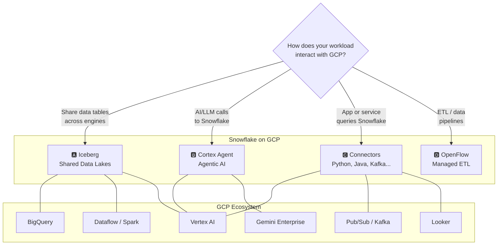

# Snowflake on Google Cloud

- **Audience:** Executives, Managers, and Architects across AI/ML, Data Engineering, BI, and Data Science  
- **Last Updated:** April 2026
- **Contact:**
    - sasha.wright-neville@snowflake.com (Partnership)
    - britny.holloway@snowflake.com (Sales)
    - ali.khosro@snowflake.com (Engineering)
    - heidi.newland@snowflake.com (Marketing)

## Executive Summary

Google Cloud is the **fastest-growing hyperscaler** — 48% year-over-year revenue growth, $17.7B quarterly revenue, and a $240B backlog. Snowflake is investing heavily to make GCP a first-class home for the AI Data Cloud.

**Snowflake on GCP** provides a complete, cloud-native AI data platform that integrates deeply with the Google Cloud ecosystem while maintaining full cloud portability. Whether your workload is analytics, AI/ML, real-time streaming, or application development — Snowflake delivers it in a fully managed, governed, and performant package.

Snowflake exchange data with other GCP services via: Iceberg, AI Agentic calls, OpenFlow, and native Connectors.

Snowflake on GCP gives customers the **Power of Choice**: use Google's frontier AI (Gemini) and open data standards (Apache Iceberg) while maintaining a cloud-agnostic, fully managed data layer that "just works." No compromises on governance, performance, or portability.

This primer covers:
- **Feature parity** across clouds and the GCP-specific roadmap
- **Five integration highways** connecting Snowflake to GCP services
- **Snowflake's core offerings** for modern data and AI workloads

## Feature Parity

Snowflake is a **cloud-agnostic, fully managed AI Data Cloud**. The core platform delivers a consistent feature set and user experience across **GCP, AWS, and Azure** and the customer experience is similar regardless of their cloud choice.

The table tracks major GCP-specific feature availability. All dates are *estimated and subject to change*.

- **Core features** — warehouses, Iceberg, Cortex AI, Snowpark, SPCS, Streamlit, Notebooks, etc. — are available on GCP
- **Newest features** (e.g., OpenFlow, Snowflake Postgres) may roll out on different schedules — the gap is typically **1–3 quarters**
- Cortex and Snowflake Intelligence support running Gemini models and on GCP, **Gemini models are the default LLMs** for Snowflake AI, giving GCP customers a unique "home-field advantage"

**Important notes:**
- Leadership is prioritizing **managed OpenFlow** over BYOC due to customer success and reduced complexity.
- Snowflake's updated direction prefers **Snowflake Postgres** over Hybrid Tables for OLTP workloads.

| Feature | Priority | Status / ETA |
|---|---|---|
| **Cortex on GCP** (cross-region) | ✅ Done | GA |
| **Gemini in Cortex** (AISQL, Analyst, SI) | ✅ Done | Public Preview |
| **Iceberg: Snowflake Managed Catalog** | ✅ Done | Public Preview | 
| **Iceberg: BigLake Metastore Integration** | ✅ Done | Private Preview | 
| **BigLake: Catalog Federation** | ✅ Done | Private Preview | 
| **Notebooks vNext in Workspaces** | ✅ Done | Private Preview |
| **Expansion (APAC)** | ✅ Done | Launched |
| **OpenFlow** (Managed) | ✅ Done | Private Preview |
| **Cortex on GCP** (in-region) | 🟠 High | Q2 FY27 |
| **Snowflake Postgres** | 🟠 High | Q3 FY27 |
| **FedRAMP on GCP** | 🟡 Medium | TBD |
| **OpenFlow** (BYOC) | 🟡 Medium | Q3 FY27 |
| **Hybrid Tables** | 🔵 Low | Q4 FY27 |

## Integration with GCP Services

Snowflake is an **integral part of the GCP stack** and works natively with GCP services including Vertex AI, BigLake, BigQuery, Gemini Enterprise, Dataflow, Pub/Sub, and Looker — as well as the broader GCP ISV ecosystem.

There are **five main highways** for Snowflake ↔ GCP communication:

## Secure Data Exchange Highways

### A — Iceberg: Shared Data Lakes on GCS

Apache Iceberg is the recommended approach for interoperability and **sharing data tables** between Snowflake and GCP services (Spark, Dataflow, Vertex AI, BigQuery). It decouples data ownership and storage from compute engines — all engines read/write to the same underlying Parquet files on GCS.

Snowflakes support internally and externally managed iceberg tables:
- **Snowflake-Managed Iceberg** — Horizon is IRC-compatible and no additional catalog needed; External engines use IRC to read/write; 
- **BigLake-Managed Iceberg** — Google BigLake owns the catalog; Snowflake reads/writes through IRC.

### B — Agentic AI: Cortex Agent + Gemini

- **Gemini is the default LLM on GCP** for Cortex Agents, Cortex Analyst, AI SQL functions, and Snowflake Intelligence
- Integrates with **Gemini Enterprise** and **Vertex AI Agent Development Kit (ADK)** via agentic REST calls.
- Customers can build multi-agent architectures where Vertex AI agents delegate data retrieval to Cortex Agent

### C — Connectors: Programmatic Access

Applications on GCP platforms can use native connectors to run a query on Snowflake and receive results. Indeed, about 25% of Snowflake consumption comes from client applications using our connectors. Also includes pure data flow connectors for streaming. Client application can a Looker dashboard, a Kafka/PubSub streaming, an app running on Cloud Run, or a Vertex AI Notebook.

### D — OpenFlow: Managed ETL

OpenFlow is Snowflake's fully managed ETL solution built on **Apache NiFi**. It runs on Snowpark Container Services — infrastructure is managed, secured, and scaled automatically.

**GCP-relevant connectors include:** Google BigQuery, Google Drive, Google Sheets, Google Ads, Kafka, Pub/Sub, GCS, and 50+ more.

### E — Data Sharing & Replication

- **Zero-copy data sharing** between Snowflake accounts — no data movement, no duplication
- **Cross-cloud replication** — replicate databases and shares across GCP, AWS, and Azure regions
- Powers **Snowflake Marketplace**, **Private Data Exchange**, and **Data Clean Rooms**

## Snowflake & Google Cloud Partnership

### Strategic Alliance

Snowflake and Google Cloud have been strategic partners since 2018, when Snowflake launched natively on GCP. The partnership has deepened significantly — in 2024, Snowflake and Google Cloud announced a multi-year expanded partnership focused on joint AI/ML innovation, go-to-market alignment, and deep product integration. Snowflake runs natively on Google Cloud infrastructure across multiple GCP regions worldwide, leveraging GCS for storage, GCE for compute, and Google's global network for cross-region replication.

### Co-Sell and Go-to-Market

The two companies operate a robust **co-sell motion** through Google Cloud Marketplace. Customers can purchase Snowflake credits directly through GCP Marketplace, which means Snowflake consumption **counts toward Google Cloud committed spend (MACC — Marketplace Aggregated Cloud Commitment)**. This is a major procurement incentive: organizations with existing GCP enterprise agreements can draw down their committed cloud spend by running Snowflake, eliminating the need for a separate contract or budget line. 

### Why It Matters for Customers

The practical impact is that choosing Snowflake on GCP is not an "either/or" — it's additive. You get Snowflake's workload isolation, governance, and cross-cloud portability alongside GCP's AI/ML ecosystem, networking, and pricing. The co-sell alignment means your Google Cloud account team is motivated to help make Snowflake successful, and the Marketplace procurement path removes friction from purchasing. For organizations already invested in GCP, Snowflake becomes a natural extension of the stack rather than a competing platform.

### Financial Incentives

For customers evaluating Snowflake on GCP, several financial levers are available:

- **MACC Drawdown** — Snowflake purchased via GCP Marketplace counts against your Google Cloud committed spend, simplifying procurement and maximizing existing commitments.
- **Migration Credits** — Snowflake offers Proof-of-Concept (POC) credits and migration assistance for workloads moving from BigQuery, on-prem (Teradata, Oracle, Netezza), or other cloud data platforms to Snowflake on GCP.
- **Joint Incentive Programs** — Google Cloud and Snowflake periodically run joint programs offering additional credits, discounted rates, or funded POCs for strategic workloads — particularly AI/ML and data lakehouse modernization initiatives.
- **ISV and Partner Programs** — Partners building on Snowflake + GCP can access joint funding for solution development, marketplace listing support, and co-marketing through the Snowflake Partner Network and Google Cloud Partner Advantage.

For Google Cloud sellers:
- **50% quota attainment**: Marketplace transactions count 50% toward their own quota attainment, creating alignment between both sales teams.

## Snowflake Core Offerings

| Feature | Use Case |
|---|---|
| **🛡️ Data Admin (Horizon)** | |
| RBAC, Masking and Trust Center | Define who can access what, mask sensitive columns, and monitor compliance posture |
| Transactional and Analytical Data | Store and query both OLTP and OLAP workloads in one platform |
| Structured, Semi-Structured, Unstructured | Govern all data types — tables, JSON, Parquet, PDFs, images — under one policy |
| Data Sharing and Replication | Share governed data with partners and replicate across regions and clouds |
| Autoscaling Gen2 Warehouse Engine | Let compute scale up/down automatically — no manual tuning needed |
| **🔧 Data Engineering** | |
| OpenFlow | Ingest streaming data from Kafka, GCS, or Pub/Sub into Snowflake tables |
| Dynamic Tables | Define transformations declaratively and let Snowflake refresh them on schedule |
| Interactive Tables | Serve sub-second queries for real-time dashboards and operational workloads |
| DBT | Model, test, and document your data transformations in version-controlled SQL |
| **🧪 Data Scientist / Developer** | |
| Notebooks vNext (SQL/Python mix) | Explore data and develop models interactively in a mixed SQL/Python environment |
| Feature Store | Create, version, and serve ML features consistently for training and inference |
| Model Registry | Register trained models with metadata, versioning, and lineage tracking |
| ML Container Runtime | Run distributed training jobs using Ray or PyTorch on GPU/CPU compute pools |
| **📱 Developer** | |
| Cortex Code | Get AI-assisted coding, debugging, and code generation in your workspace |
| Workspaces | Collaborate on code in a Git-backed IDE with branching and CI/CD workflows |
| Snowflake Postgres | Build transactional apps with Postgres wire-compatible real-time data access |
| Native Connectors | Connect your Python, Go, Java, Kafka, or Spark applications to Snowflake |
| SP Container Services | Deploy and run custom Docker containers, APIs, and microservices |
| Snowflake Marketplace | Publish your data products or consume third-party datasets and apps |
| **📊 Analyst** | |
| Snowflake Intelligence | Ask questions about your data in natural language and get AI-generated answers |
| Snowsight | Write SQL queries, build charts, and share dashboards with your team |
| Streamlit | Build and publish interactive data apps without writing frontend code |
| **🤖 Cortex AI** | |
| Cortex Functions | Summarize, classify, extract, translate, and analyze text using LLMs |
| Cortex Search | Build hybrid vector + keyword search over your documents and data |
| Cortex Analyst | Let users ask natural language questions that auto-generate SQL queries |
| Cortex Agents | Orchestrate multi-step AI workflows that reason, plan, and use tools |
| MCP Client and Server | Integrate external tools and services via the Model Context Protocol |
| Cortex REST APIs | Access all Cortex AI services from external applications via REST |

## Why Snowflake on GCP
Snowflake is fully managed AI data cloud with built-in security and governance that integrated easily with GCP services.

| Pillar | What It Means |
|---|---|
| **Easy** | fully managed, near-zero maintenance platform, instant elasticity, SQL and Python interfaces. |
| **Integrated** | break down data silos and integrate across multiple clouds and ecosystems, seamless integration with GCP services |
| **Trusted** | built-in security, governance, and business continuity that ensures your data is protected. |
| **Complete** | Zero data movement and zero ETL. Run all your workloads (AI, ML, DE, BI) where your data lives. |
| **OLTP and OLAP** | Snowflake Postgres for transactional, interactive tables for near-realtime dashboards/workloads, dynamic auto-scaling warehouse for analytical. |
| **High Accuracy AI** | Cortex provides higher accuracy and lower hallucination because of visibility to metadata, query history, and semantic views. |

## References

- [Partnership Page](https://snowflake.seismic.com/Link/Content/DCfWjJDRB9dg9GmPDm2WVFcmd9F3)
- [GCP Dashboard](https://go/gcp-dashboard)
- [Feature Parity Tracker (Spreadsheet)](https://docs.google.com/spreadsheets/d/1p22ahwnb3h1NEaCG77tYMuVN0Ob59eY9cqZMUe2gOQQ/edit?usp=sharing)
- [Snowflake on GCP Reference Architecture (Slides)](https://docs.google.com/presentation/d/1O5LaL691F9lWdzzl6oTjWvqFIVyry5_NBN0zmjZ6NhU/edit?usp=sharing)
- [GitHub: GCP-Snowflake Solutions](https://github.com/sfc-gh-akhosro/gcp-snowflake-solutions)

- [Snowflake Iceberg Tables Documentation](https://docs.snowflake.com/en/user-guide/tables-iceberg)
- [Iceberg Quickstart Guide](https://quickstarts.snowflake.com/guide/getting_started_iceberg_tables/index.html)
- [OpenFlow Connectors Documentation](https://docs.snowflake.com/en/user-guide/data-integration/openflow/connectors/about-openflow-connectors)
- [Cortex Agents Documentation](https://docs.snowflake.com/en/user-guide/snowflake-cortex/cortex-agents)
- [Snowpark Container Services on GCP](https://docs.snowflake.com/en/developer-guide/snowpark-container-services/overview)

